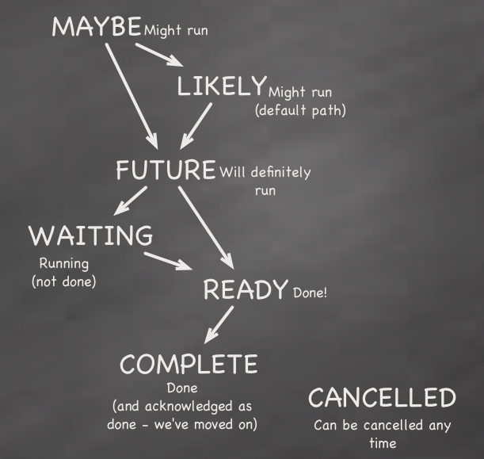

The Basics
==========

Introduction
------------

The process of using Spiff Workflow involves the following steps:

#. Create a workflow specification. A specification may be written using BPMN,
   JSON, or Python
   (`example <https://github.com/knipknap/SpiffWorkflow/blob/master/tests/SpiffWorkflow/data/spiff/workflow1.py>`_).
#. Run the workflow using the Python API. Example code for running the workflow::

    from SpiffWorkflow.specs import *
    from SpiffWorkflow import Workflow

    spec = WorkflowSpec()
    # (Add tasks to the spec here, or create one directly from an existing file)

    wf = Workflow(spec)
    wf.complete_task_from_id(...)

Specification vs. Workflow Instance
-----------------------------------

One critical concept to know about SpiffWorkflow is the difference between a
:class:`SpiffWorkflow.specs.WorkflowSpec` and :class:`SpiffWorkflow.Workflow` and
the difference between a :class:`SpiffWorkflow.specs.TaskSpec` and :class:`SpiffWorkflow.Task`.

In order to understand how to handle a running workflow consider the following process::

    Choose product -> Choose amount -> Produce product A
                                  `--> Produce product B

As you can see, in this case the process resembles a simple tree. *Choose product*,
*Choose amount*, *Produce product A*, and *Produce product B* are all specific kinds
of *task specifications*, and the whole process is a *workflow specification*.

But when you execute the workflow, the path taken does not necessarily have the same shape. For example, if the user chooses to produce 3 items of product A, the path taken looks like the following::

    Choose product -> Choose amount -> Produce product A
                                  |--> Produce product A
                                  `--> Produce product A

This is the reason why you will find two different categories of objects in Spiff Workflow:

- **Specification objects** (WorkflowSpec and TaskSpec) represent the workflow definition, and
- **derivation tree objects** (Workflow and Task) model the task tree that represents the state of a running workflow.

Defining a Workflow
-------------------

The WorkflowSpec and TaskSpec classes are used to define a workflow. SpiffWorkflow has many types of TaskSpecs: Join, Split, Execute, Wait, and all others are derived from TaskSpec. The specs can be serialized and deserialized to a variety of formats.

.. note::
   SpiffWorkflow has two XML serializers:

   - :mod:`SpiffWorkflow.serializer.xml` is the standard that is
     feature-complete, and you should use it for implementing workflow
     persistence.
   - :mod:`SpiffWorkflow.serializer.prettyxml` supports
     deserialization of a more human-friendly XML format. It does not
     support the full set of features, and it does not support
     serialization.
     You will want to use it when you are writing the XML by hand.

We will use :module:`SpiffWorkflow.serializer.prettyxml` throughout this tutorial.

A WorkflowSpec is built by chaining TaskSpecs together in a tree. You can either assemble workflow using Python objects (see the example linked above), or by loading it from XML such as follows::

    from SpiffWorkflow.serializer.xml import XmlSerializer

    serializer = XmlSerializer()
    xml_file = 'my_workflow.xml'
    xml_data = open(xml_file).read()
    spec = serializer.deserialize_workflow_spec(xml_data, xml_file)
    ...

(Passing the filename to the deserializer is optional, but improves error messages.)

For a full list of all TaskSpecs see the :mod:`SpiffWorkflow.specs` module.
All classes have full API documentation. To understand better how each individual subtype of
TaskSpec works, look at `the workflow patterns <http://www.workflowpatterns.com>`_ web site;
especially the flash animations showing how each type of task works.

.. note::
   The TaskSpec classes named "ThreadXXXX" do **not** create any Python threads, but logical
   threads based on the model in http://www.workflowpatterns.com. There is no Python
   threading implemented.

Running a workflow
------------------

To run the workflow, create an instance of the *Workflow* class as follows::

    from SpiffWorkflow import Workflow

    spec = ... # see above

    wf = Workflow(spec)
    ...

The *Workflow* object then represents the state of this particular instance of the running workflow. In other words, it includes the derivation tree and the data, by holding a tree that is composed of *Task* objects.
All changes in the progress or state of a workflow are always reflected in one (or more) of the *Task* objects. Each Task has a *state*, and can hold *data*.

.. HINT::
   To visualize the state of a running workflow, you may use the :meth:`SpiffWorkflow.Workflow.dump` method to print the task tree to stdout.

Some tasks change their state automatically based on internal or environmental changes. Other tasks may need to be triggered by you, the user. The latter kind of tasks can, for example, be completed by calling::

    wf.complete_task_from_id(...)

Understanding task states
-------------------------

The following task states exist:

The states are reached in a strict order and the lines in the diagram show the possible state transitions.

The order of these state transitions is violated only in one case: A *Trigger* task may add additional work to a task that was already COMPLETED, causing it to change the state back to FUTURE.

- **MAYBE** means that the task will possibly, but not necessarily run at a future time. This means that it can not yet be fully determined as to whether or not it may run, for example, because the execution still depends on the outcome of an ExclusiveChoice task in the path that leads towards it.

- **LIKELY** is like MAYBE, except it is considered to have a higher probability of being reached because the path leading towards it is the default choice in an ExclusiveChoice task.

- **FUTURE** means that the processor has predicted that this this path will be taken and this task will, at some point, definitely run. (Unless the task is explicitly set to CANCELLED, which can not be predicted.) If a task is waiting on predecessors to run then it is in FUTURE state (not WAITING).

- **WAITING** means *I am in the process of doing my work and have not finished. When the work is finished, then I will be READY for completion and will go to READY state*. WAITING is an optional state.

- **READY** means "the preconditions for marking this task as complete are met".

- **COMPLETED** means that the task is done.

- **CANCELLED** means that the task was explicitly cancelled, for example by a CancelTask operation.

Associating data with a workflow
--------------------------------

The difference between *specification objects* and *derivation tree objects* is also important when choosing how to store data in a workflow. Spiff Workflow supports storing data in two ways:

- **Task spec data** is stored in the TaskSpec object. In other words, if a task causes task spec data to change, that change is reflected to all other instances in the derivation tree that use the TaskSpec object.
- **Task data** is local to the Task object, but is carried along to the children of each Task object in the derivation tree as the workflow progresses.

Other documentation
-------------------

**API documentation** is currently embedded into the Spiff Workflow source code and not yet made available in a prettier form.

If you need more help, please create an issue in our
`issue tracker <https://github.com/knipknap/SpiffWorkflow/issues>`_.
