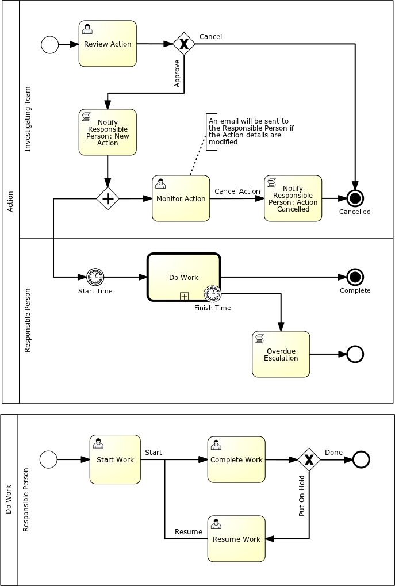

.. _bpmn_page:

Business Process Model and Notation (BPMN)
==========================================

Business Process Model and Notation (BPMN) is a standard for business process modeling that
provides a graphical notation for specifying business processes, based on a flowcharting technique.
The objective of BPMN is to support business process management, for both technical users and business users,
by providing a notation that is intuitive to business users, yet able to represent complex
process semantics. The BPMN specification also provides a standard XML serialization format, which
is what Spiff Workflow parses.

A reasonable subset of the BPMN notation is supported, including the following elements:

  1. Call Activity
  2. Start Event
  3. End Event (including interrupting)
  4. User and Manual Tasks
  5. Script Task
  6. Exclusive Gateway
  7. Inclusive Gateway (converging only)
  8. Parallel Gateway
  9. Intermediate Catch Events (Timer and Message)
  10. Boundary Events (Timer and Message, interrupting and non-interrupting)

   Example BPMN Workflow

Please refer to http://www.bpmn.org/ for details on BPMN and to the API documentation for instructions on the
use of the BPMN implementation.
