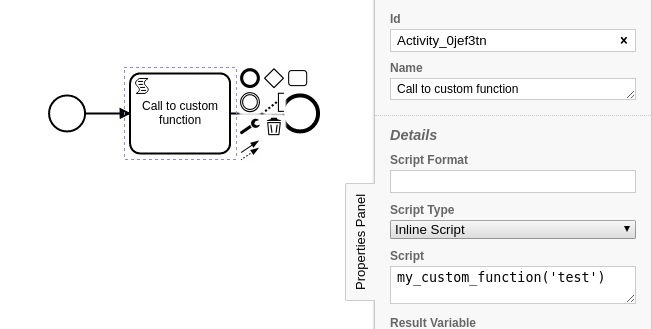

Scripting Enhancements
===================================

SpiffWorkflow is really flexible, and allows us to update and alter a workflow to adjust to the changing business
needs of your application. While this is great and leads to faster time to market,
SpiffWorkflow can only go so far. When you are implementing a 'real' project, it is likely you will need to be able
to use your favorite library, use your own python functions or inject variables into a scripting environment.

Luckily, SpiffWorkflow is able to do this with minor modifications.

Lets take a look at a very simple workflow that needs to use a custom function.

   custom script task

Here we can see that we have created a workflow that is calling a function 'my_custom_function' in a ScriptTask

Lets take a look at the code in ExampleCode-custom-script.py, and how it differs from our original code ExampleCode.py

We have added the following:

.. code:: python
   :number-lines: 2

    from SpiffWorkflow.bpmn.BpmnScriptEngine import BpmnScriptEngine

this imports the default script engine so that we can make changes to it, and then we define our custom function.
Note that the name is not my_custom_function, we control that when we update the scripting engine

.. code:: python
   :number-lines: 6

    def testScript(input):
        print('hello from testScript with input %s'%input)

finally, we need to make some changes to how we load our workflow. Of course we need to alter our workflow file name
and the id of the workflow, but we are also making an instance of the scripting engine with the additions we would
like to have in our script, and passing this into the workflow as we create it.

.. code:: python
   :number-lines: 27

    x = CamundaParser()
    x.add_bpmn_file('custom_script.bpmn')
    spec = x.get_spec('custom_script')

    script_engine = BpmnScriptEngine(scriptingAdditions={'my_custom_function':testScript})
    workflow = BpmnWorkflow(spec,script_engine=script_engine)

When we run the workflow we get a very simple output

.. code:: bash

    my-prompt$ python ExampleCode-custom-script.py
    hello from testScript with input test
    {}

This should open a whole world of possibilities and allow for as much customization as needed for your application.

