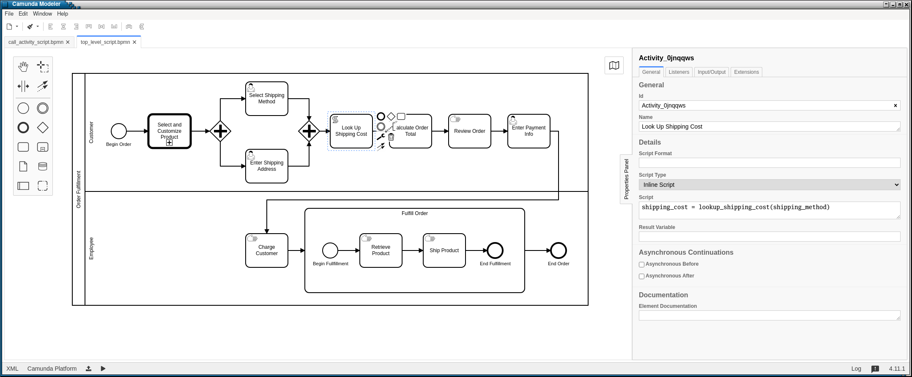
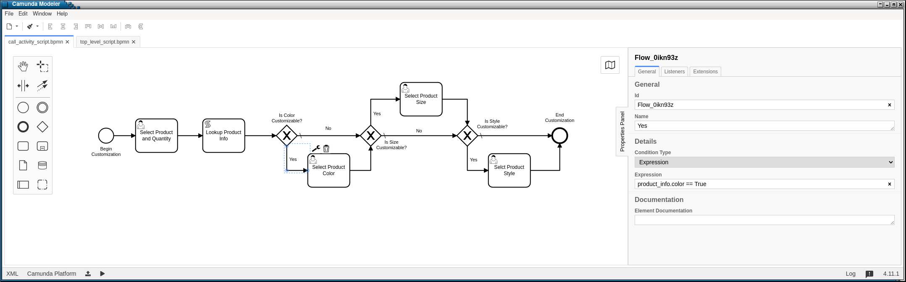

A More In-Depth Look at Some of SpiffWorkflow's Features
========================================================

Filtering Tasks
---------------

In our earlier example, all we did was check the lane a task was in and display
it along with the task name and state.

Lets take a look at a sample workflow with lanes:

.. figure:: figures/lanes.png
   :scale: 30%
   :align: center

   Workflow with lanes

To get all of the tasks that are ready for the 'Customer' workflow, we could
specify the lane when retrieving ready user tasks:

.. code:: python

     ready_tasks = workflow.get_ready_user_tasks(lane='Customer')

If there were no tasks ready for the 'Customer' lane, you would get an empty list,
and of course if you had no lane that was labeled 'Customer' you would *always* get an
empty list.

We can also get a list of tasks by state.

We need to import the :code:`Task` object (unless you want to memorize which numbers
correspond to which states).

.. code:: python

    from SpiffWorkflow.task import TaskState

To get a list of completed tasks

.. code:: python

    tasks = workflow.get_tasks(TaskState.COMPLETED)

The tasks themselves are not particularly intuitive to work with.  So SpiffWorkflow
provides some facilities for obtaining a more user-friendly version of upcoming tasks.

Logging
-------

Spiff provides several loggers:
 - the :code:`spiff` logger, which emits messages when a workflow is initialized and when tasks change state
 - the :code:`spiff.metrics` logger, which emits messages containing the elapsed duration of tasks
 - the :code:`spiff.data` logger, which emits message when task or workflow data is updated.

Log level :code:`INFO` will provide reasonably detailed information about state changes.

As usual, log level :code:`DEBUG` will probably provide more logs than you really want
to see, but the logs will contain the task and task internal data.

Data can be included at any level less than :code:`INFO`.  In our exmple application,
we define a custom log level

.. code:: python

    logging.addLevelName(15, 'DATA_LOG')

so that we can see the task data in the logs without fully enabling debugging.

The workflow runners take an `-l` argument that can be used to specify the logging level used
when running the example workflows.

Serialization
-------------

.. warning::

   Serialization Changed in Version 1.1.7.
   Support for pre-1.1.7 serialization will be dropped in a future release.
   The old serialization method still works but it is deprecated.
   To migrate your system to the new version, see "Migrating between
   serialization versions" below.

So far, we've only considered the context where we will run the workflow from beginning to end in one
setting. This may not always be the case, we may be executing the workflow in the context of a web server where we
may have a user request a web page where we open a specific workflow that we may be in the middle of, do one step of
that workflow and then the user may be back in a few minutes, or maybe a few hours depending on the application.

The :code:`BpmnWorkflowSerializer` class contains a serializer for a workflow containing only standard BPMN Tasks.
Since we are using custom task classes (the Camunda :code:`UserTask` and the DMN :code:`BusinessRuleTask`),
we'll need to supply serializers for those task specs as well.

Strictly speaking, these are not serializers per se: they actually convert the tasks into dictionaries of
JSON-serializable objects.  Conversion to JSON is done only as the last step and could easily be replaced with some
other output format.

We'll need to configure a Workflow Spec Converter with our custom classes, as well as an optional
custom data converter.

.. code:: python

    def create_serializer(task_types, data_converter=None):

        wf_spec_converter = BpmnWorkflowSerializer.configure_workflow_spec_converter(task_types)
        return BpmnWorkflowSerializer(wf_spec_converter, data_converter)

We'll call this from our main script:

.. code:: python

    serializer = create_serializer([ UserTaskConverter, BusinessRuleTaskConverter ], custom_data_converter)

We first configure a workflow spec converter that uses our custom task converters, and then we create
a :code:`BpmnWorkflowSerializer` from our workflow spec and data converters.

We'll give the user the option of dumping the workflow at any time.

.. code:: python

    filename = input('Enter filename: ')
    state = serializer.serialize_json(workflow)
    with open(filename, 'w') as dump:
        dump.write(state)

We'll ask them for a filename and use the serializer to dump the state to that file.

To restore the workflow:

.. code:: python

    if args.restore is not None:
        with open(args.restore) as state:
            wf = serializer.deserialize_json(state.read())

The workflow serializer is designed to be flexible and modular and as such is a little complicated.  It has
two components:

- a workflow spec converter (which handles workflow and task specs)
- a data converter (which handles workflow and task data).

The default workflow spec converter likely to meet your needs, either on its own, or with the inclusion of
:code:`UserTask` and :code:`BusinessRuleTask` in the :code:`camnuda` or :code:`spiff` and :code:`dmn` subpackages
of this library, and all you'll need to do is add them to the list of task converters, as we did above.

However, he default data converter is very simple, adding only JSON-serializable conversions of :code:`datetime`
and :code:`timedelta` objects (we make these available in our default script engine) and UUIDs.  If your
workflow or task data contains objects that are not JSON-serializable, you'll need to extend ours, or extend
its base class to create one of your own.

To extend ours:

1.  Subclass the base data converter
2.  Register classes along with functions for converting them to and from dictionaries

.. code:: python

    from SpiffWorkflow.bpmn.serializer.dictionary import DictionaryConverter

    class MyDataConverter(DictionaryConverter):

        def __init__(self):
            super().__init__()
            self.register(MyClass, self.my_class_to_dict, self.my_class_from_dict)

        def my_class_to_dict(self, obj):
            return obj.__dict__

        def my_class_from_dict(self, dct):
            return MyClass(**dct)

More information can be found in the class documentation for the
`default converter <https://github.com/sartography/SpiffWorkflow/blob/main/SpiffWorkflow/bpmn/serializer/bpmn_converters.py>`_
and its `base class <https://github.com/sartography/SpiffWorkflow/blob/main/SpiffWorkflow/bpmn/serializer/dictionary.py>`_
.

You can also replace ours entirely with one of your own.  If you do so, you'll need to implement `convert` and
`restore` methods.  The former should return a JSON-serializable representation of your workflow data; the
latter should recreate your data from the serialization.

If you have written any custom task specs, you'll need to implement task spec converters for those as well.

Task Spec converters are also based on the :code:`DictionaryConverter`.  You should be able to use the
`BpmnTaskSpecConverter <https://github.com/sartography/SpiffWorkflow/blob/main/SpiffWorkflow/bpmn/serializer/bpmn_converters.py>`_
as a basis for your custom specs.  It provides some methods for extracting attributes from Spiff base classes as well as
standard BPNN attributes from tasks that inherit from :code:`BMPNSpecMixin`.

The `Camunda User Task Converter <https://github.com/sartography/SpiffWorkflow/blob/main/SpiffWorkflow/camunda/serializer/task_spec_converters.py>`_
should provide a simple example of how you might create such a converter.

Migrating Between Serialization Versions
----------------------------------------

Old (Non-Versioned) Serializer
^^^^^^^^^^^^^^^^^^^^^^^^^^^^^^

Prior to Spiff 1.1.7, the serialized output did not contain a version number.

.. code:: python

    old_serializer = BpmnSerializer() # the deprecated serializer.
    # new serializer, which can be customized as described above.
    serializer = BpmnWorkflowSerializer(version="MY_APP_V_1.0")

The new serializer has a :code:`get_version` method that will read the version
back out of the serialized json.  If the version isn't found, it will return
:code:`None`, and you can then assume it is using the old style serializer.

.. code:: python

   version = serializer.get_version(some_json)
   if version == "MY_APP_V_1.0":
        workflow = serializer.deserialize_json(some_json)
   else:
        workflow = old_serializer.deserialize_workflow(some_json, workflow_spec=spec)

If you are not using any custom tasks and do not require custom serialization, then you'll be able to
serialize the workflow in the new format:

.. code:: python

    new_json = serializer.serialize_json(workflow)

However, if you use custom tasks or data serialization, you'll also need to specify workflow spec or data
serializers, as in the examples in the previous section, before you'll be able to serialize with the new serializer.
The code would then look more like this:

.. code:: python

    from SpiffWorkflow.camunda.serializer import UserTaskConverter

    old_serializer = BpmnSerializer() # the deprecated serializer.

    # new serializer, with customizations
    wf_spec_converter = BpmnWorkflowSerializer.configure_workflow_spec_converter([UserTaskConverter])
    data_converter = MyDataConverter
    serializer = BpmnWorkflowSerializer(wf_spec_converter, data_converter, version="MY_APP_V_1.0")

    version = serializer.get_version(some_json)
    if version == "MY_APP_V_1.0":
         workflow = serializer.deserialize_json(some_json)
    else:
         workflow = old_serializer.deserialize_workflow(some_json, workflow_spec=spec)

    new_json = serializer.serialize_json(workflow)

Because the serializer is highly customizable, we've made it possible for you to manage your own versions of the
serialization.  You can do this by passing a version number into the serializer, which will be embedded in the
json of all workflows.  This allow you to modify the serialization and customize it over time, and still manage
the different forms as you make adjustments without leaving people behind.

Versioned Serializer
^^^^^^^^^^^^^^^^^^^^

As we make changes to Spiff, we may change the serialization format.  For example, in 1.1.8, we changed
how subprocesses were handled interally in BPMN workflows and updated how they are serialized.   If you have
not overridden our version number with one of your own, the serializer will transform the 1.0 format to the
new 1.1 format.

If you've overridden the serializer version, you may need to incorporate our serialization changes with
your own.  You can find our conversions in
`version_migrations.py <https://github.com/sartography/SpiffWorkflow/blob/main/SpiffWorkflow/bpmn/serializer/version_migration.py>`_

Custom Script Engines
---------------------

You may need to modify the default script engine, whether because you need to make additional
functionality available to it, or because you might want to restrict its capabilities for
security reasons.

.. warning::

   The default script engine does little to no sanitization and uses :code:`eval`
   and :code:`exec`!  If you have security concerns, you should definitely investigate
   replacing the default with your own implementation.

We'll cover a simple extension of custom script engine here.  There is also an examples of
a similar engine based on `RestrictedPython <https://restrictedpython.readthedocs.io/en/latest/>`_
included alongside this example.

The default script engine does not import any objects.

You could add functions or classes from the standard python modules or any code you've
implemented yourself.  Your global environment can be passed in using the `default_globals`
argument when initializing the script engine.  In our RestrictedPython example, we use their
`safe_globals` which prevents users from executing some potentially unsafe operations.

In our example models so far, we've been using DMN tables to obtain product information.  DMN
tables have a **lot** of uses so we wanted to feature them prominently, but in a simple way.

If a customer was selecting a product, we would surely have information about how the product
could be customized in a database somewhere.  We would not hard code product information in
our diagram (although it is much easier to modify the BPMN diagram than to change the code
itself!).  Our shipping costs would not be static, but would depend on the size of the order and
where it was being shipped -- maybe we'd query an API provided by our shipper.

SpiffWorkflow is obviously **not** going to know how to make a call to **your** database or
make API calls to **your** vendors.  However, you can implement the calls yourself and make them
available as a method that can be used within a script task.

We are not going to actually include a database or API and write code for connecting to and querying
it, but we can model our database with a simple dictionary lookup since we only have 7 products
and just return the same static info for shipping for the purposes of the tutorial.

.. code:: python

    from collections import namedtuple

    from SpiffWorkflow.bpmn.PythonScriptEngine import PythonScriptEngine

    ProductInfo = namedtuple('ProductInfo', ['color', 'size', 'style', 'price'])

    INVENTORY = {
        'product_a': ProductInfo(False, False, False, 15.00),
        'product_b': ProductInfo(False, False, False, 15.00),
        'product_c': ProductInfo(True, False, False, 25.00),
        'product_d': ProductInfo(True, True, False, 20.00),
        'product_e': ProductInfo(True, True, True, 25.00),
        'product_f': ProductInfo(True, True, True, 30.00),
        'product_g': ProductInfo(False, False, True, 25.00),
    }

    def lookup_product_info(product_name):
        return INVENTORY[product_name]

    def lookup_shipping_cost(shipping_method):
        return 25.00 if shipping_method == 'Overnight' else 5.00

    additions = {
        'lookup_product_info': lookup_product_info,
        'lookup_shipping_cost': lookup_shipping_cost
    }

    CustomScriptEngine = PythonScriptEngine(scripting_additions=additions)

We pass the script engine we created to the workflow when we load it.

.. code:: python

    return BpmnWorkflow(parser.get_spec(process), script_engine=CustomScriptEngine)

We can use the custom functions in script tasks like any normal function:

   Workflow with lanes

And we can simplify our 'Call Activity' flows:

   Workflow with lanes

To run this workflow:

.. code-block:: console

    ./run.py -p order_product -b bpmn/call_activity_script.bpmn bpmn/top_level_script.bpmn

It is also possible to completely replace `exec` and `eval` with something else, or to
execute or evaluate statements in a completely separate environment by subclassing the
:code:`PythonScriptEngine` and overriding `_execute` and `_evaluate`.  We have examples of
executing code inside a docker container or in a celery task i this repo.

MultiInstance Notes
-------------------

**loopCardinality** - This variable can be a text representation of a
number - for example '2' or it can be the name of a variable in
task.data that resolves to a text representation of a number.
It can also be a collection such as a list or a dictionary. In the
case that it is a list, the loop cardinality is equal to the length of
the list and in the case of a dictionary, it is equal to the list of
the keys of the dictionary.

If loopCardinality is left blank and the Collection is defined, or if
loopCardinality and Collection are the same collection, then the
MultiInstance will loop over the collection and update each element of
that collection with the new information. In this case, it is assumed
that the incoming collection is a dictionary, currently behavior for
working with a list in this manner is not defined and will raise an error.

**Collection** This is the name of the collection that is created from
the data generated when the task is run. Examples of this would be
form data that is generated from a UserTask or data that is generated
from a script that is run. Currently the collection is built up to be
a dictionary with a numeric key that corresponds to the place in the
loopCardinality. For example, if we set the loopCardinality to be a
list such as ['a','b','c] the resulting collection would be {1:'result
from a',2:'result from b',3:'result from c'} - and this would be true
even if it is a parallel MultiInstance where it was filled out in a
different order.

**Element Variable** This is the variable name for the current
iteration of the MultiInstance. In the case of the loopCardinality
being just a number, this would be 1,2,3, . . .  If the
loopCardinality variable is mapped to a collection it would be either
the list value from that position, or it would be the value from the
dictionary where the keys are in sorted order.  It is the content of the
element variable that should be updated in the task.data. This content
will then be added to the collection each time the task is completed.

Example:
  In a sequential MultiInstance, loop cardinality is ['a','b','c'] and elementVariable is 'myvar'
  then in the case of a sequential multiinstance the first call would
  have 'myvar':'a' in the first run of the task and 'myvar':'b' in the
  second.

Example:
  In a Parallel MultiInstance, Loop cardinality is a variable that contains
  {'a':'A','b':'B','c':'C'} and elementVariable is 'myvar' - when the multiinstance is ready, there
  will be 3 tasks. If we choose the second task, the task.data will
  contain 'myvar':'B'.
