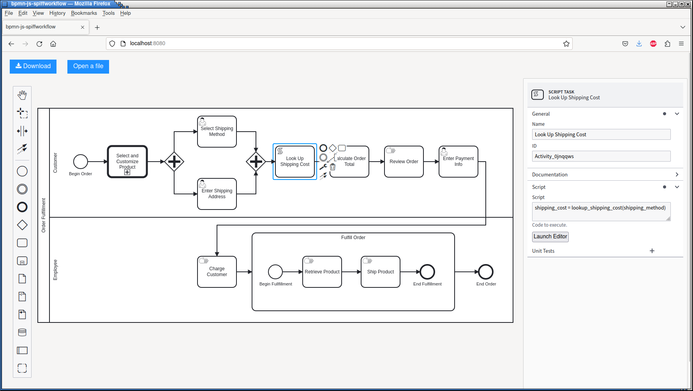
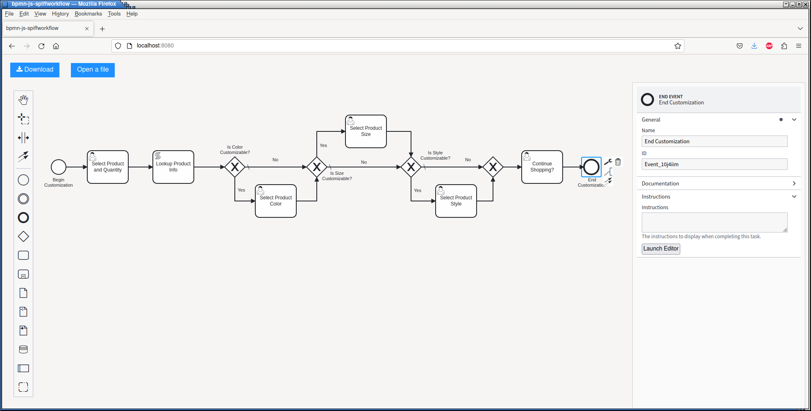

A More In-Depth Look at Some of SpiffWorkflow's Features
========================================================

BPMN Task Specs
---------------

BPMN Tasks inherit quite a few attributes from :code:`SpiffWorkflow.specs.base.TaskSpec`, but only a few are used.

* `name`: the unique id of the TaskSpec, and it will correspond to the BPMN ID if that is present
* `description`: we use this attribute to provide a description of the BPMN type (the text that appears here can be overridden in the parser)
* `inputs`: a list of TaskSpec `names` that are parents of this TaskSpec
* `outputs`:  a list of TaskSpec `names` that are children of this TaskSpec
* `manual`: :code:`True` if human input is required to complete tasks associated with this TaskSpec

BPMN Tasks have the following additional attributes.

* `bpmn_id`: the ID of the BPMN Task (this will be :code:`None` if the task is not visible on the diagram)
* `bpmn_name`: the BPMN name of the Task
* `lane`: the lane of the BPMN Task
* `documentation`: the contents of the BPMN `documentation` element for the Task
* `data_input_associations`: a list of incoming data object references
* `data_output_associtions`: a list of outgoing data object references
* `io_specification`: the BPMN IO specification of the Task

Filtering Tasks
---------------

Tasks by Lane
^^^^^^^^^^^^^

The :code:`workflow.get_ready_user_tasks` method optionally takes the argument `lane`, which can be used to
restrict the tasks returned to only tasks in that lane.

.. code:: python

     ready_tasks = workflow.get_ready_user_tasks(lane='Customer')

will return only tasks in the 'Customer' lane in our example workflow.

Tasks by Spec Name
^^^^^^^^^^^^^^^^^^

To retrieve a list of tasks associated with a particular task spec, use :code:`workflow.get_tasks_from_spec_name`

.. code:: python

    tasks = workflow.get_tasks_from_spec_name('customize_product')

will return a list containing the Call Actitivities for the customization of a product in our example workflow.

.. note::

    The `name` paramter here refers to the task spec name, not the BPMN name (for visible tasks, this will
    be the same as the `bpmn_id`)

Tasks by State
^^^^^^^^^^^^^^

We need to import the :code:`TaskState` object (unless you want to memorize which numbers correspond to which states).

.. code:: python

    from SpiffWorkflow.util.task import TaskState
    tasks = workflow.get_tasks(TaskState.COMPLETED)

will return a list of completed tasks.

See :doc:`../concepts` for more information about task states.

Tasks in a Subprocess or Call Activity
^^^^^^^^^^^^^^^^^^^^^^^^^^^^^^^^^^^^^^

The :code:`BpmnWorkflow` class maintains a dictionary of subprocesses (the key is the `id` of the Call Activity or
Subprocess Task).  :code:`workflow.get_tasks` will start at the top level workflow and recurse through the subprocesses
to create a list of all tasks.  It is also possible to start from a particular subprocess:

.. code:: python

    tasks = workflow.get_tasks_from_spec_name('customize_product')
    subprocess = workflow.get_subprocess(tasks[0])
    subprocess_tasks = workflow.get_tasks(workflow=subprocess)

will limit the list of returned tasks to only those in the first product customization.

.. note::

    Each :code:`Task` object has a reference to its workflow; so with a Task inside a subprocess, we can call
    :code:`workflow.get_tasks(workflow=task.workflow)` to start from our current workflow.

Logging
-------

Spiff provides several loggers:
 - the :code:`spiff` logger, which emits messages when a workflow is initialized and when tasks change state
 - the :code:`spiff.metrics` logger, which emits messages containing the elapsed duration of tasks
 - the :code:`spiff.data` logger, which emits a message when :code:`task.update_data` is called or workflow data is retrieved or set.

Log level :code:`INFO` will provide reasonably detailed information about state changes.

As usual, log level :code:`DEBUG` will probably provide more logs than you really want
to see, but the logs will contain the task and task internal data.

Data can be included at any level less than :code:`INFO`.  In our example application,
we define a custom log level

.. code:: python

    logging.addLevelName(15, 'DATA')

so that we can see the task data in the logs without fully enabling debugging.

The workflow runners take an `-l` argument that can be used to specify the logging level used when running the example workflows.

We'll write the logs to a file called `data.log` instead of the console to avoid printing very long messages during the workflow.

Our logging configuration code can be found in `runner/shared.py`.  Most of the code is about logging
configuration in Python rather than anything specific to SpiffWorkflow, so we won't go over it in depth.

Parsing
-------

Each of the BPMN pacakges (:code:`bpmn`, :code:`spiff`, or :code:`camunda`) has a parser that is preconfigured with
the specs in that package (if a particular TaskSpec is not implemented in the package, :code:`bpmn` TaskSpec is used).

See the example in :doc:`synthesis` for the basics of creating a parser.  The parser can optionally be initialized with

- a set of namespaces (useful if you have custom extensions)
- a BPMN Validator (the one in the :code:`bpmn` package validates against the BPMN 2.0 spec)
- a mapping of XML tag to Task Spec Descriptions.  The default set of descriptions can be found in
  :code:`SpiffWorkflow.bpmn.parser.spec_descriptions`.  These values will be added to the Task Spec in the `description` attribute
  and are intended as a user-friendly description of what the task is.

The :code:`BpmnValidator` can be used and extended independently of the parser as well; call :code:`validate` with
an :code:`lxml` parsed tree.

Loading BPMN Files
^^^^^^^^^^^^^^^^^^

In addition to :code:`load_bpmn_file`, there are similar functions :code:`load_bpmn_str` which can load the XML from a string, and
:code:`load_bpmn_io`, which can load XML from any object implementing the IO interface, and :code:`add_bpmn_xml`, which can load
BPMN specs from an :code:`lxml` parsed tree.

Dependencies
^^^^^^^^^^^^

The following methods are available for discovering the names of processes and DMN files that may be defined externally:

- :code:`get_subprocess_specs`: Returns a mapping of name -> :code:`BpmnWorkflowSpec` for any Call Activities referenced by the
  provided spec (searches recursively)
- :code:`find_all_spec`: Returns a mapping of name -> :code:`BpmnWorkflowSpec` for all processes used in all files that have been
  provided to the parser at that point.
- :code:`get_process_dependences`: Returns a list of process IDs referenced by the provided process ID
- :code:`get_dmn_dependencies`: Returns a list of DMN IDs referenced by the provided process ID

Serialization
-------------

The :code:`BpmnWorkflowSerializer` has two components

* the `workflow_spec_converter` (which handles serialization of objects that SpiffWorkflow knows about)
* the `data_converter` (which handles serialization of custom objects)

Unless you have overriden any of TaskSpecs with custom specs, you should be able to use the serializer
configuration from the package you are importing the parser from (:code:`bpmn`, :code:`spiff`, or :code:`camunda`).
See :doc:`synthesis` for an example.

Serializing Custom Objects
^^^^^^^^^^^^^^^^^^^^^^^^^^

In `Custom Script Engines`_ , we add some custom methods and objects to our scripting environment.  We create a simple
class (a :code:`namedtuple`) that holds the product information for each product.

We'd like to be able to save and restore our custom object.

.. code:: python

    ProductInfo = namedtuple('ProductInfo', ['color', 'size', 'style', 'price'])

    def product_info_to_dict(obj):
        return {
            'color': obj.color,
            'size': obj.size,
            'style': obj.style,
            'price': obj.price,
        }

    def product_info_from_dict(dct):
        return ProductInfo(**dct)

    registry = DictionaryConverter()
    registry.register(ProductInfo, product_info_to_dict, product_info_from_dict)

Here we define two functions, one for turning our object into a dictionary of serializable objects, and one for recreating
the object from the dictionary representation we created.

We initialize a :code:`DictionaryConverter` and `register` the class and methods.

Registering an object sets up relationships between the class and the serialization and deserialization methods.  We go
over how this works in a little more detail in `Custom Serialization in More Depth`_.

It is also possible to bypass using a :code:`DictionaryConverter` at all for the data serialization process (but not for
the spec serialization process).  The only requirement for the the `data_converter` is that it implement the methods

- `convert`, which takes an object and returns something JSON-serializable
- `restore`, which takes a serialized version and returns an object

Serialization Versions
^^^^^^^^^^^^^^^^^^^^^^

As we make changes to Spiff, we may change the serialization format.  For example, in 1.2.1, we changed
how subprocesses were handled interally in BPMN workflows and updated how they are serialized and we upraded the
serializer version to 1.1.

As we release SpiffWorkflow 2.0, there are several more substantial changes, and we'll upgrade the serializer version to 1.2.

Since workflows can contain arbitrary data, and even SpiffWorkflow's internal classes are designed to be customized in ways
that might require special serialization and deserialization, it is possible to override the default version number, to
provide users with a way of tracking their own changes.  This can be accomplished by setting the `VERSION` attribute on
the :code:`BpmnWorkflowSerializer` class.

If you have not provided a custom version number, SpiffWorkflow wil attempt to migrate your workflows from one version
to the next if they were serialized in an earlier format.

If you've overridden the serializer version, you may need to incorporate our serialization changes with
your own.  You can find our conversions in
`SpiffWorkflow/bpmn/serilaizer/migrations <https://github.com/sartography/SpiffWorkflow/tree/main/SpiffWorkflow/bpmn/serializer/migration>`_

These are broken up into functions that handle each individual change, which will hopefully make it easier to incoporate them
into your upgrade process, and also provides some documentation on what has changed.

Custom Serialization in More Depth
^^^^^^^^^^^^^^^^^^^^^^^^^^^^^^^^^^

Both of the serializer components mentioned in `Serialization`_ are based on the :code:`DictionaryConverter`.  Let's import
it and create one and register a type:

.. code:: python

    from datetime import datetime

    from SpiffWorkflow.bpmn.serializer.helpers.dictionary import DictionaryConverter
    registry = DictionaryConverter()
    registry.register(
        datetime.
        lambda dt: {'value': dt.isoformat() },
        lambda dct: datetime.fromisoformat(dct['value'])
    )

The arguemnts to :code:`register` are:

* `cls`: the class to be converted
* `to_dict`: a function that returns a dictionary containing JSON-serializable objects
* `from_dict`: a function that take the output of `to_dict` and restores the original object

When the :code:`register` method is called, a `typename` is created  and maps are set up between `cls` and `to_dict`
function, `cls` and `typename`, and `typename` and `from_dict`.

When :code:`registry.convert` is called on an object, the `cls` is use to retrieve the `to_dict` function and the
`typename`.  The `to_dict` funciton is called on the object and the `typename` is added to the resulting dictionary.

When :code:`registry.restore` is called with a dictionary, it is checked for a `typename` key, and if one exists, it
is used to retrieve the `from_dict` function and the dictionary is passed to it.

If an object is not recognized, it will be passed on as-is.

Custom Script Engines
---------------------

You may need to modify the default script engine, whether because you need to make additional
functionality available to it, or because you might want to restrict its capabilities for
security reasons.

.. warning::

   By default, the scripting environment passes input directly to :code:`eval` and :code:`exec`!  In most
   cases, you'll want to replace the default scripting environment with one of your own.

Files referenced in this section:

* `script_engine.py <https://github.com/sartography/spiff-example-cli/blob/main/runner/script_engine.py>`_
* `product_info.py <https://github.com/sartography/spiff-example-cli/blob/main/runner/product_info.py>`_
* `subprocess.py <https://github.com/sartography/spiff-example-cli/blob/main/runner/subprocess.py>`_
* `spiff-bpmn-runner.py <https://github.com/sartography/spiff-example-cli/blob/main/spiff-bpmn-runner.py>`_

The following example replaces the default global enviroment with the one provided by
`RestrictedPython <https://restrictedpython.readthedocs.io/en/latest/>`_

.. code:: python

    from RestrictedPython import safe_globals
    from SpiffWorkflow.bpmn.PythonScriptEngine import PythonScriptEngine
    from SpiffWorkflow.bpmn.PythonScriptEngineEnvironment import TaskDataEnvironment

    restricted_env = TaskDataEnvironment(safe_globals)
    restricted_script_engine = PythonScriptEngine(environment=restricted_env)

Another reason you might want to customize the scripting environment is to provide access to custom
classes or functions.

In our example models so far, we've been using DMN tables to obtain product information.  DMN
tables have a **lot** of uses so we wanted to feature them prominently, but in a simple way.

If a customer was selecting a product, we would surely have information about how the product
could be customized in a database somewhere.  We would not hard code product information in
our diagram (although it is much easier to modify the BPMN diagram than to change the code
itself!).  Our shipping costs would not be static, but would depend on the size of the order and
where it was being shipped -- maybe we'd query an API provided by our shipper.

SpiffWorkflow is obviously **not** going to know how to query **your** database or make API calls to
**your** vendors.  However, one way of making this functionality available inside your diagram is to
implement the calls in functions and add those functions to the scripting environment, where they
can be called by Script Tasks.

We are not going to actually include a database or API and write code for connecting to and querying
it, but since we only have 7 products we can model our database with a simple dictionary lookup
and just return the same static info for shipping for the purposes of the tutorial.

We'll define some resources in `product_info.py`

.. code:: python

    from collections import namedtuple

    ProductInfo = namedtuple('ProductInfo', ['color', 'size', 'style', 'price'])

    INVENTORY = {
        'product_a': ProductInfo(False, False, False, 15.00),
        'product_b': ProductInfo(False, False, False, 15.00),
        'product_c': ProductInfo(True, False, False, 25.00),
        'product_d': ProductInfo(True, True, False, 20.00),
        'product_e': ProductInfo(True, True, True, 25.00),
        'product_f': ProductInfo(True, True, True, 30.00),
        'product_g': ProductInfo(False, False, True, 25.00),
    }

    def lookup_product_info(product_name):
        return INVENTORY[product_name]

    def lookup_shipping_cost(shipping_method):
        return 25.00 if shipping_method == 'Overnight' else 5.00

We'll add these functions to our scripting environment in `script_engine.py`

.. code:: python

    env_globals = {
        'lookup_product_info': lookup_product_info,
        'lookup_shipping_cost': lookup_shipping_cost,
        'datetime': datetime,
    }
    custom_env = TaskDataEnvironment(env_globals)
    custom_script_engine = PythonScriptEngine(environment=custom_env)

.. note::

    We're also adding :code:`datetime`, because we added the timestamp to the payload of our message when we
    set up the Message Event (see :doc:`events`)

When we initialize the runner in `spiff-bpmn-runner.py`, we'll import and use `custom_script_engine` as our
script engine.

We can use the custom functions in script tasks like any normal function.  We've replaced the Business Rule
Task that determines product price with a script that simply checks the `price` field on our product.

   Top Level Workflow with Custom Script Engine

And we can simplify the gateways in our 'Call Activity' flows as well now too:

   Call Activity with Custom Script Engine

To run this workflow (you'll have to manually change which script engine you import):

.. code-block:: console

    ./spiff-bpmn-runner.py -p order_product -b bpmn/tutorial/top_level_script.bpmn bpmn/tutorial/call_activity_script.bpmn

Another reason to customize the scripting enviroment is to allow it to run completely separately from
SpiffWorkflow.  You might wish to do this for performance or security reasons.

In our example repo, we've created a simple command line script in `runner/subprocess.py` that takes serialized global
and local environments and a script or expression to execute or evaluate.  In `runner/script_engine.py`, we create
a scripting environment that runs the current :code:`execute` or :code:`evaluate` request in a subprocess with this
script.  We've imported our custom methods into `subprocess.py` so they are automatically available when it is used.

This example is needlessly complex for the work we're doing in this case, but the point of the example is to demonstrate
that this could be a Docker container with a complex environment, an HTTP API running somewhere else entirely.

.. note::

    Note that our execute method returns :code:`True`.  We could check the status of our process here and return
    :code:`False` to force our task into an `ERROR` state if the task failed to execute.

    We could also return :code:`None`
    if the task is not finished; this will cause the task to go into the `STARTED` state.  You would have to manually
    complete a task that has been `STARTED`.  The purpose of the state is to tell SpiffWorkflow your application will
    handle monitoring and updating this task and other branches that do not depend on this task may proceed.  It is
    intended to be used with potentially long-running tasks.

    See :doc:`../concepts` for more information about Task States and Workflow execution.

Service Tasks
-------------

Service Tasks are also executed by the workflow's script engine, but through a different method, with the help of some
custom extensions in the :code:`spiff` package:

- `operation_name`, the name assigned to the service being called
- `operation_params`, the parameters the operation requires

This is our script engine and scripting environment:

.. code:: python

    service_task_env = TaskDataEnvironment({
        'product_info_from_dict': product_info_from_dict,
        'datetime': datetime,
    })

    class ServiceTaskEngine(PythonScriptEngine):

        def __init__(self):
            super().__init__(environment=service_task_env)

        def call_service(self, operation_name, operation_params, task_data):
            if operation_name == 'lookup_product_info':
                product_info = lookup_product_info(operation_params['product_name']['value'])
                result = product_info_to_dict(product_info)
            elif operation_name == 'lookup_shipping_cost':
                result = lookup_shipping_cost(operation_params['shipping_method']['value'])
            else:
                raise Exception("Unknown Service!")
            return json.dumps(result)

    service_task_engine = ServiceTaskEngine()

Instead of adding our custom functions to the enviroment, we'll override :code:`call_service` and call them directly
according to the `operation_name` that was given.  The :code:`spiff` Service Task also evaluates the parameters
against the task data for us, so we can pass those in directly.  The Service Task will also store our result in
a user-specified variable.

We need to send the result back as json, so we'll reuse the functions we wrote for the serializer.

The Service Task will assign the dictionary as the operation result, so we'll add a `postScript` to the Service Task
that retrieves the product information that creates a :code:`ProductInfo` instance from the dictionary, so we need to
import that too.

The XML for the Service Task looks like this:

.. code:: xml

    <bpmn:serviceTask id="Activity_1ln3xkw" name="Lookup Product Info">
      <bpmn:extensionElements>
        <spiffworkflow:serviceTaskOperator id="lookup_product_info" resultVariable="product_info">
          <spiffworkflow:parameters>
            <spiffworkflow:parameter id="product_name" type="str" value="product_name"/>
          </spiffworkflow:parameters>
        </spiffworkflow:serviceTaskOperator>
        <spiffworkflow:postScript>product_info = product_info_from_dict(product_info)</spiffworkflow:postScript>
      </bpmn:extensionElements>
      <bpmn:incoming>Flow_104dmrv</bpmn:incoming>
      <bpmn:outgoing>Flow_06k811b</bpmn:outgoing>
    </bpmn:serviceTask>

Getting this information into the XML is a little bit beyond the scope of this tutorial, as it involves more than
just SpiffWorkflow.  I hand edited it for this case, but you can hardly ask your BPMN authors to do that!

Our `modeler <https://github.com/sartography/bpmn-js-spiffworkflow>`_ has a means of providing a list of services and
their parameters that can be displayed to a BPMN author in the Service Task configurtion panel.  There is an example of
hard-coding a list of services in
`app.js <https://github.com/sartography/bpmn-js-spiffworkflow/blob/0a9db509a0e85aa7adecc8301d8fbca9db75ac7c/app/app.js#L47>`_
and as suggested, it would be reasonably straightforward to replace this with a API call.  `SpiffArena <https://www.spiffworkflow.org/posts/articles/get_started/>`_
has robust mechanisms for handling this that might serve as a model for you.

How this all works is obviously heavily dependent on your application, so we won't go into further detail here, except
to give you a bare bones starting point for implementing something yourself that meets your own needs.

To run this workflow (you'll have to manually change which script engine you import):

.. code-block:: console

    ./spiff-bpmn-runner.py -p order_product -b bpmn/tutorial/top_level_service_task.bpmn bpmn/tutorial/call_activity_service_task.bpmn

