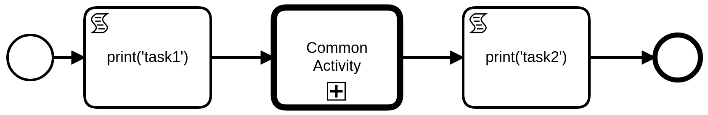
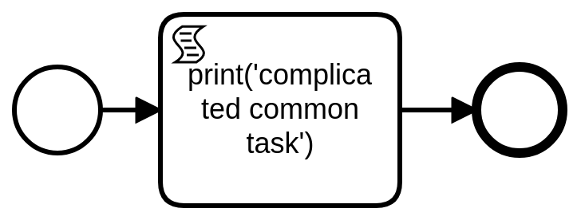
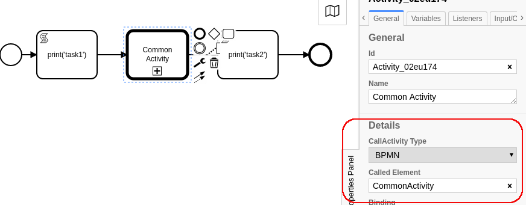

Call Activity
===================================

Our previous section hinted at a way of grouping tasks so that we can manage the complexity of workflows, and a
mechanism for re-using workflows if we have a 'subroutine' that is somewhat complicated and we would like to be more
efficient by making the workflow just once and then re-using it in many different locations.

A CallActivity allows us to do this. Here are two different workflows - one for the top level and one for the bottom
level.

Essentially, we will add both bpmn documents in the code where we used to add just one. The first workflow will
reference the second based upon its workflow ID.

In the first figure, I have the CallActivity Task highlighted, and you can see in the configuration box on the right
hand side that the call activity references the task ID from the subworkflow.

And then in the second workflow, we can see that I've set the workflow id to be the same as I'm referencing in the
first file. Again, to set the workflow id, we click on the background of the workflow and we can set it in the right
hand panel. (please note, if we are using pools and lanes, this is slightly different, you will need to click on the
pool and set it there)

.. figure:: images/sublevelexample.png
   :align: center

This workflow, when run will simply perform the task activities in order, the script tasks all do what is printed in
the task description, so we would expect it to

   1) print('task1')
   2) print('complicated common task')
   3) print('task2')

I've put code for doing this in ExampleCode-Sub.py - and we can see that the only difference in the code is that we
have changed the name of the files and the id of the starting activity.

.. code:: python
   :number-lines: 23

   x = CamundaParser()
   x.add_bpmn_file('top_workflow.bpmn')
   x.add_bpmn_file('common_workflow.bpmn')

   spec = x.get_spec('top_workflow')

When we run this new code - we can see that it does exactly what we expect it to

.. code::

   python ExampleCode-Sub.py
   task1
   complicated common task
   task2
   {}

