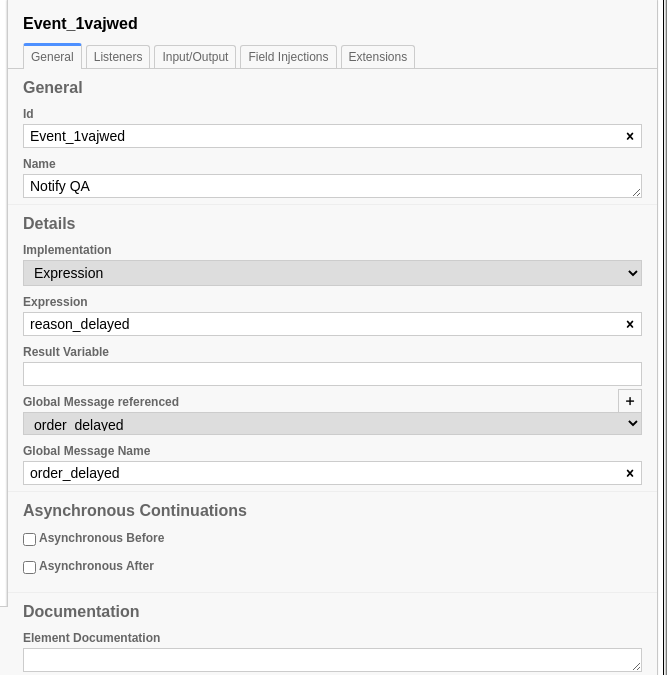

Events
======

Message Events
--------------

Configuring Message Events
^^^^^^^^^^^^^^^^^^^^^^^^^^

   Throw Message Event configuration

.. figure:: figures/message_start_event.png
   :scale: 60%
   :align: center

   Message Catch Event configuration

The Throw Message Event Implementation should be 'Expression' and the Expression should
be a Python statement that can be evaluated.  In this example, we'll just send the contents
of the :code:`reason_delayed` variable, which contains the response from the 'Investigate Delay'
Task.

We can provide a name for the result variable, but I have not done that here, as it does not
make sense to me for the generator of the event to tell the handler what to call the value.
If you *do* specify a result variable, the message payload (the expression evaluated in the
context of the Throwing task) will be added to the handling task's data in a variable of that
name; if you leave it blank, SpiffWorkflow will create a variable of the form <Handling
Task Name>_Response.

Running the Model
^^^^^^^^^^^^^^^^^

If you have set up our example repository, this model can be run with the
following command:

.. code-block:: console

   ./camunda-bpmn-runner.py -c order_collaboration \
        -d bpmn/tutorial/product_prices.dmn bpmn/tutorial/shipping_costs.dmn \
        -b bpmn/camunda/events.bpmn bpmn/camunda/call_activity.bpmn