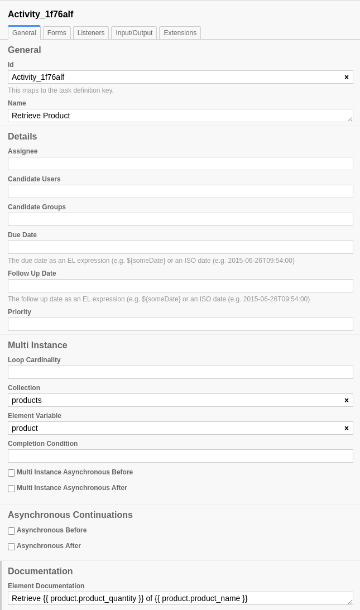

MultiInstance Tasks
===================

Earlier versions of SpiffWorkflow relied on the properties available in the Camunda MultiInstance Panel.

   MultiInstance Task configuration

SpiffWorkflow has a MultiInstance Task spec in the :code:`camunda` package that interprets these fields
in the following way:

* Loop Cardinality:

   - If this is an integer, or a variable that evaluates to an integer, this number would be 
     used to determine the number of instances
   - If this is a collection, the size of the collection would be used to determine the number of
     instances

* Collection: the output collection (input collections have to be specified in the "Cardinality" field).

* Element variable: the name of the varible to copy the item into for each instance.

.. warning::

   The spec in this package is based on an old version of Camunda, which might or might not have been the
   way Camunda uses these fields, and may or may not be similar to newer or current versions. 
   *Use at your own risk!*
