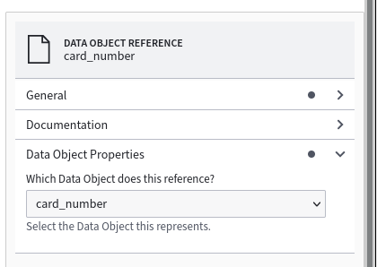
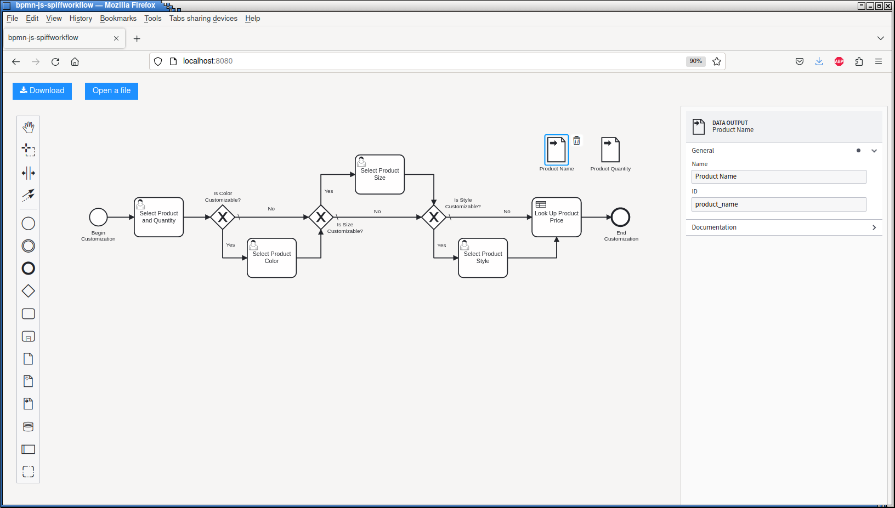

Data
====

BPMN Model
----------

We'll be using the following files from `spiff-example-cli <https://github.com/sartography/spiff-example-cli>`_.

- `bpmn-spiff/events <https://github.com/sartography/spiff-example-cli/blob/main/bpmn/tutorial/events.bpmn>`_ workflow
- `bpmn-spiff/call_activity <https://github.com/sartography/spiff-example-cli/blob/main/bpmn/tutorial/call_activity.bpmn>`_ workflow
- `bpmn-spiff/data_output <https://github.com/sartography/spiff-example-cli/blob/main/bpmn/tutorial/data_output.bpmn>`_ workflow
- `product_prices <https://github.com/sartography/spiff-example-cli/blob/main/bpmn/tutorial/product_prices.dmn>`_ DMN table
- `shipping_costs <https://github.com/sartography/spiff-example-cli/blob/main/bpmn/tutorial/shipping_costs.dmn>`_ DMN table

Data Objects
^^^^^^^^^^^^

 Data Objects exist at the process level and are not visible in the diagram, but when you create a Data Object
 Reference, you can choose what Data Object it points to.

   Configuring a Data Object Reference

When a Data Output association (a line) is drawn from a task to a Data Object Reference, the value is copied
from the task data to the workflow data and removed from the task.  If a Data Input Association is created from
a Data Object Reference, the value is temporarily copied into the task data while the task is being executed,
and immediate removed afterwards.

This allows sensitive data to be removed from individual tasks (in our example, the customer's credit card
number).  It can also be used to prevent large objects from being repeatedly copied from task to task.

Multiple Data Object References can point to the same underlying data.  In our example, we use two references
to the same Data Object to pass the credit card info to both tasks that require it.  On the right panel, we can
see that only one data object exists in the process.

.. figure:: figures/data/data_objects.png
   :scale: 30%
   :align: center

   Data objects in a process

If you step through this workflow, you'll see that the card number is not contained in the task data after
the 'Enter Payment Info' has been completed but is available to the 'Charge Customer' task later on.

Running The Model
*****************

If you have set up our example repository, this model can be run with the following command:

.. code-block:: console

   ./spiff-bpmn-runner.py -c order_collaboration \
        -d bpmn/tutorial/product_prices.dmn bpmn/tutorial/shipping_costs.dmn \
        -b bpmn/tutorial/events.bpmn bpmn/tutorial/call_activity.bpmn

Data Inputs and Outputs
^^^^^^^^^^^^^^^^^^^^^^^

In complex workflows, it is useful to be able to specify required Data Inputs and Outputs, especially for Call Activities
given that they are external and might be shared across many different processes.

When you add a Data Input to a Call Activity, SpiffWorkflow will check that a variable with that name is available to
be copied into the activity and copy *only* the variables you've specified as inputs.  When you add a Data Output,
SpiffWorkflow will copy *only* the variables you've specified from the Call Activity at the end of the process.  If any
of the variables are missing, SpiffWorkflow will raise an error.

Our product customization Call Activity does not require any input, but the output of the process is the product
name and quantity.  We can add corresponding Data Outputs for those.

   Data Outputs in a Call Activity

If you use this version of the Call Activity and choose a product that has customizations, when you inspect the data
after the Call Activity completes, you'll see that the customizations have been removed.  We won't continue to use this
version of the Call Activity, because we want to preserve all the data.

.. note::

   The BPMN spec allows *any* task to have Data Inputs and Outputs. Our modeler does not provide a way to add them to
   arbitrary tasks, but SpiffWorkflow will recognize them on any task if they are present in the BPMN XML.

Running The Model
*****************

If you have set up our example repository, this model can be run with the following command:

.. code-block:: console

   ./spiff-bpmn-runner.py -p order_product \
        -d bpmn/tutorial/product_prices.dmn bpmn/tutorial/shipping_costs.dmn \
        -b bpmn/tutorial/top_level.bpmn bpmn/tutorial/data_output.bpmn
