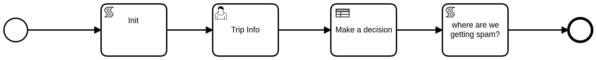

DMN and Decision Tables
=======================

What is DMN
-----------

Decision Model and Notation (DMN) is a standard for business decision modeling. DMN allows modelers to separate decision logic from process logic and maintain it in a table format. DMN is linked into BPMN with a *decision task*.

BPMN Model With DMN
--------------------------------

With DMN, business analysts can model the rules that lead to a decision in an easy to read table. Those tables can be executed directly by SpiffWorkflow.

This minimizes the risk of misunderstandings between business analysts and developers, and allows rapid changes in production.

BPMN includes a decision task that refers to the decision table. The outcome of the decision lookup allows the next gateway or activity to route the flow.

In the BPMN model below we build on our basic example. It includes a business rules task named *Make a decision*. This is where the decision table lookup is called on the BPMN side. The result of the table lookup is used by the *Where are we getting spam?* task.

Decision Table
----------------------

Here is the decision table for our *Make a decision* lookup.

.. image:: images/dmn.png

Based on their response to the *Location* question, we make a lookup in the table. We can then send them a message about where to get spam.

If they go camping or stay in a cabin, we tell them to bring spam. If they stay in a hotel, we tell them they can buy it near the hotel.

DMN tables also allow annotations that help explain entries in the table.

Changes to ExampleCode.py
-------------------------

Up to this point, all of our BPMN models run using the code in ExampleCode.py. (We do need to updata the file and process names.)

For DMN, we need to modify our code so that we can import a DMN table.

This code is in Example-dmn.py.

Below are the code changes that happened to make this happen

We import a second parser.

.. code:: python

   from SpiffWorkflow.dmn.parser.BpmnDmnParser import BpmnDmnParser

and create a class based on the new parser.

.. code:: python

    class MyCustomParser(BpmnDmnParser):
     """
     A BPMN and DMN parser that can also parse Camunda forms.
     """
     OVERRIDE_PARSER_CLASSES = BpmnDmnParser.OVERRIDE_PARSER_CLASSES
     OVERRIDE_PARSER_CLASSES.update(CamundaParser.OVERRIDE_PARSER_CLASSES)

This new class can parse both BPMN and DMN, along with the basic form elements
supported in Camunda's free editor.

To use the new class, we change

.. code:: python

   parser = MyCustomParser()
   parser.add_bpmn_file('BasicExample.bpmn')
   spec = parser.get_spec('BasicExample')

to

.. code:: python

    parser = MyCustomParser()
    parser.add_bpmn_file('decision_table.bpmn')
    parser.add_dmn_file('spam_decision.dmn')
    spec = parser.get_spec('step1')

Note that we add both a bpmn file and a dmn file to the parser.

.. sidebar:: TODO

   This should really change - it seems really confusing to a person new to this as to why I should have to create a
   custom class to do this.

With this new code, we can run the DMN workflow.

Here is some sample output from running Example-dmn.py.

.. code:: bash

    $ python ExampleCode-dmn.py
    Where are you going? (Options: cabin, hotel, camping)? cabin
    ['location']
    Do you like spam? Yes
    ['spam']
    {'location': 'cabin', 'spam': 'Yes'}
    Make sure to pack Spam!
    {'location': 'cabin', 'spam': 'Yes', 'spampurchase': 'Make sure to pack Spam!'}
