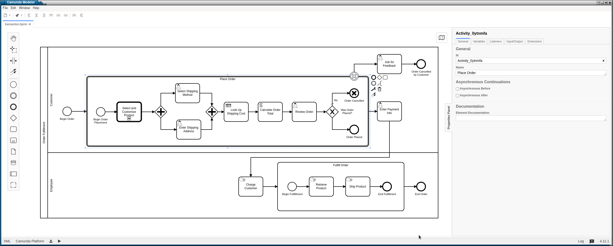
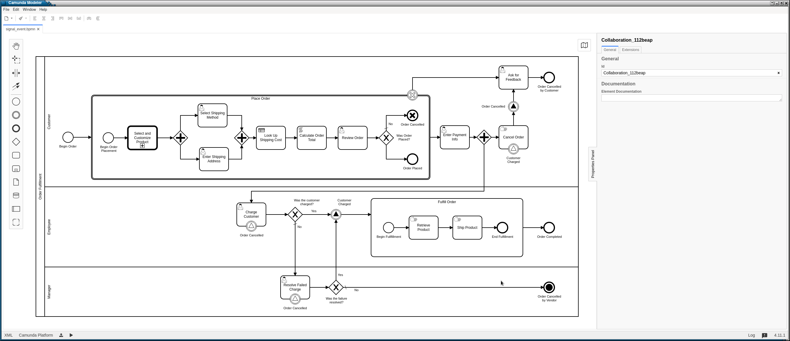
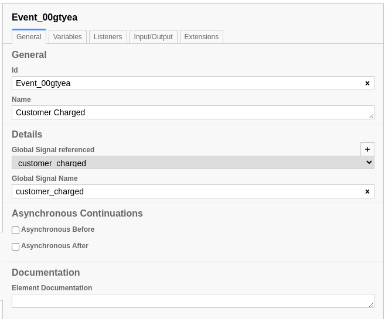
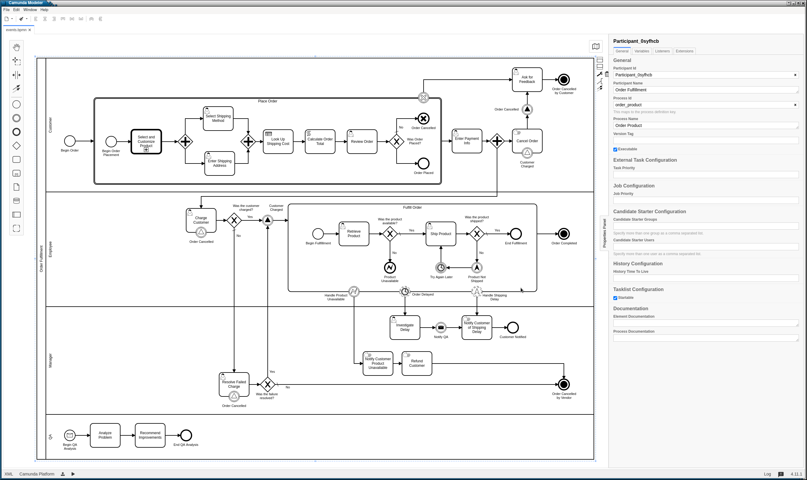
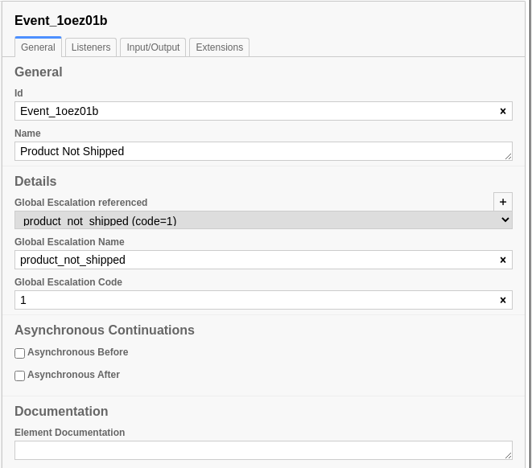
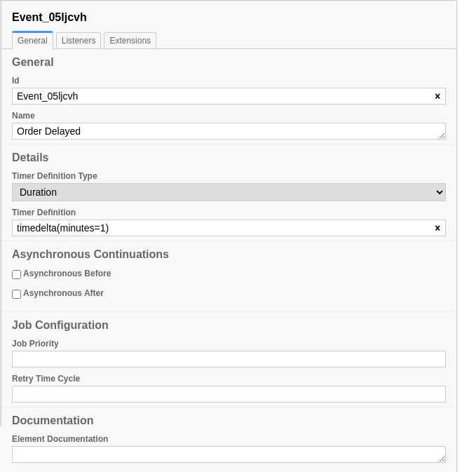

Events 
======

BPMN Model
----------

We'll be using the the `transaction 
<https://github.com/sartography/SpiffExample/bpmn/transaction.bpmn>`_ and
`call activity <https://github.com/sartography/SpiffExample/bpmn/call_activity.bpmn>`_
workflows, as well as the `product_prices 
<https://github.com/sartography/SpiffExample/bpmn/product_prices.dmn>`_
and `shipping_costs <https://github.com/sartography/SpiffExample/bpmn/shipping_costs.dmn>`_
DMN tables from `SpiffExample <https://github.com/sartography/SpiffExample>`_.

So far, all of the transistions in our workflow are deterministic and involve
direct connections between tasks.  We need to handle the cases where an event
may or may not happen and link these events in different parts of the workflow.

BPMN has a comprehensive suite of event elements that can used for this purpose.
SpiffWorkflow does not support every single BPMN event type, but it can handle 
many of them.  In this section, we'll go over the events that can be used by
SpiffWorkflow.

SpiffWorkflow supports the following Event Definitions:

- `Cancel Events`_
- `Signal Events`_
- `Terminate Events`_
- `Error Events`_
- `Escalation Events`_
- `Timer Events`_
- `Message Events`_

A general overview of events in BPMN can be found in the :doc:`/intro`
section of the documentation.

We'll include examples of all of these types in this section.

Transactions
^^^^^^^^^^^^

We also need to introduce the concept of a transaction, bceause certain events
can only be used in that context.  A transaction is essentially a subprocess, but
it must fully complete before it affects its outer workflow.

We'll make our customer's ordering process through the point they review their order 
into a transaction.  If they do not complete their order, then product selections and
customizations will be discarded; if they place the order, the workflow will proceed 
as before.

We'll also introduce our first event type, the Cancel Event.  Cancel Events can
only be used in Transactions.

Cancel Events
^^^^^^^^^^^^^

   Workflow with a transaction and Cancel Event

We changed our 'Review Order' Task to be a User Task and have added a form, so
that we can give the customer the option of cancelling the order.  If the customer
answers 'Y', then the workflow ends normally and we proceed to collecting
payment information.

However, if the user elects to cancel their order, we use a 'Cancel End Event'
instead, which generates a Cancel Event.  We can then attach a 'Cancel Boundary
Event' to the transaction, and execute that path if the event occurs.  Instead of
asking the customer for their payment info, we'll direct them to a form and ask 
them why they cancelled their order.

If the order is placed, the workflow will contain the order data; if it is
cancelled, it will contain the reason for cancellation instead.

Running the `transaction workflow`_.

Signal Events
^^^^^^^^^^^^^

   Workflow with Signal Events

Suppose we also want to give our customer the ability to cancel their order at
any time up until they are charged.  We need to throw an event after the charge
is placed and catch this event before the user completes the 'Cancel Order' task.
Once the charge is placed, the task that provides the option to cancel will 
itself be cancelled when the charge event is received.

We'll also need to detect the case that the customer cancels their order and
cancel the charge task if it occurs; we'll use a separate signal for that.

Multiple tasks can catch the same signal event.  Suppose we add a Manager role
to our workflow, and allow the Employee to refer unsuccessful charges to the
Manager for resolution.  The Manager's task will also need to catch this signal
event.

Signals are referred to by name.

   Signal Event configuration

Running the `signal workflow`_.

.. Terminate Events:

Terminate Events
^^^^^^^^^^^^^^^^

We also added a Terminate Event to the Manager Workflow.  A regular End Event
simply marks the end of a path.  A Terminate Event will indicate that the
entire workflow is complete and any remaining tasks should be cancelled.  Our
customer cannot cancel order that has already been cancelled, and we won't ask
them for feedback about it, so we do not want to execute either of those
tasks.

We'll now modify our workflow to add an example of each of the other types of
events that SpiffWorkflow Supports.

Error Events
^^^^^^^^^^^^

Let's turn to our order fulfillment subprocess.  Either of these steps could 
potentially fail, and we may want to handle each case differently.

   Workflow with multiple event types

One potential failure is that our product is unavailable.  This actually might be
a temporary problem, but we'll assume that it is a show stopper for the sake of
this tutorial.

We ask the Employee to verify that they were able to retrieve the product; if they
were unable to do so, then we generate an Error End Event, which we will handle
with an Interrupting Error Boundary Event (Error events are *always* Interrupting).

If the product is unavailable, our Manager will notify the customer, issue a refund,
and cancel the order.

Escalation Events
^^^^^^^^^^^^^^^^^

Escalation events are a lot like Error Events and as far as I can tell, which one
to use comes down to preference.  In our example, we'll assume that if we failed to
ship the product, we can try again later, so we will not end the Subprocess
(Escalation events can be either Interrupting or Non-Interrupting).

However, we still want to notify our customer of a delay, so we use a Non-Interrupting
Escalation Boundary Event.

Both Error and Escalation Events can be optionally associated with a code.  Here is
Throw Event for our `product_not_shipped` Escalation.

   Throw Escalation Event configuration

Error Event configuration is similar.

If no code is provided in a Catch event, any event of the corresponding type will catch 
the event.

Timer Events
^^^^^^^^^^^^

In the previous section, we mentioned that that we would try again later if we were unable
to ship the order.  We can use a Duration Timer Event to force our workflow to wait a cetain
amount of time before continuing.  We can use this as a regular Intermediate Event (in
'Try Again Later') or a Boundary Event.  Timer Boundary Events can be Interrupting, but in
this case, we simply want to notify the customer of the delay while continuing to process 
their order, so we use a Non-Interrupting Event.

   Duration Timer Event configuration

We express the duration as a python timedelta.  We show the configuration for the Boundary
Event.

It is also possible to use a static datetime to trigger an event.

Timer events can only be caught, that is waited on.  The timer begins implicitly when we
reach the event.

Message Events
^^^^^^^^^^^^^^

.. sidebar:: QA Lane

   Ideally, this lane would be a process independent from the ordering process however, 
   limitations of how SpiffWorkflow handles processes precludes multiple top-level
   processes.

In BPMN, Messages are used to communicate across processes and cannot be used within a 
workflow, but SpiffWorkflow allows message communication between laness well as between
parent and child workflows.  We'll use the first scenario in our example.

We've added a QA lane to out ordering process, whose job is investigating order order delays
and recommending improvements.  This portion of our process will only be started when an
appropriate message is received.

Messages are similar to signals, in that they are referenced by name, but they have the 
additional property that they may contain a payload.

.. note::

   We currently depend on some Camunda-specific features in our implementation, but we
   intend to replace this with our own.

.. figure:: figures/throw_message_event.png
   :scale: 30%
   :align: center

   Throw Message Event configuration

The Throw Message Event Implementation should be 'Expression' and the Expression should
be a python statement that can be evaluated.  In this example, we'll just send the contents
of the :code:`reason_delayed` variable, which contains the response from the 'Investigate Delay' 
Task.

We can provide a name for the result variable, but I have not done that here, as it does not
make sense to me for the generator of the event to tell the handler what to call the value.
If you *do* specify a result variable, the message payload (the expression evaluated in the
context of the Throwing task) will be added to the handling task's data in a variable of that 
name; if you leave it blank, SpiffWorkflow will create a variable of the form <Handling 
Task Name>_Response.

Running The Models
------------------

Transaction Workflow
^^^^^^^^^^^^^^^^^^^^

If you have set up our example repository, this model can be run with the
following command:

.. code-block:: console

   ./run.py -p order_product \
        -d bpmn/product_prices.dmn bpmn/shipping_costs.dmn \
        -b bpmn/transaction.bpmn bpmn/call_activity.bpmn

Signal Workflow
^^^^^^^^^^^^^^^

If you have set up our example repository, this model can be run with the
following command:

.. code-block:: console

   ./run.py -p order_product \
        -d bpmn/product_prices.dmn bpmn/shipping_costs.dmn \
        -b bpmn/signal_event.bpmn bpmn/call_activity.bpmn

Events Workflow
^^^^^^^^^^^^^^^

If you have set up our example repository, this model can be run with the
following command:

.. code-block:: console

   ./run.py -p order_product \
        -d bpmn/product_prices.dmn bpmn/shipping_costs.dmn \
        -b bpmn/events.bpmn bpmn/call_activity.bpmn

