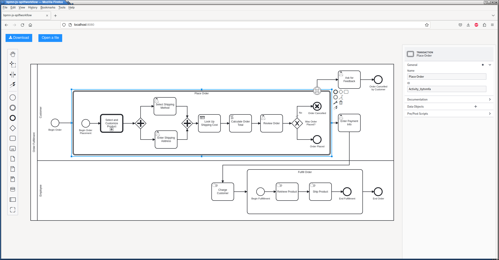
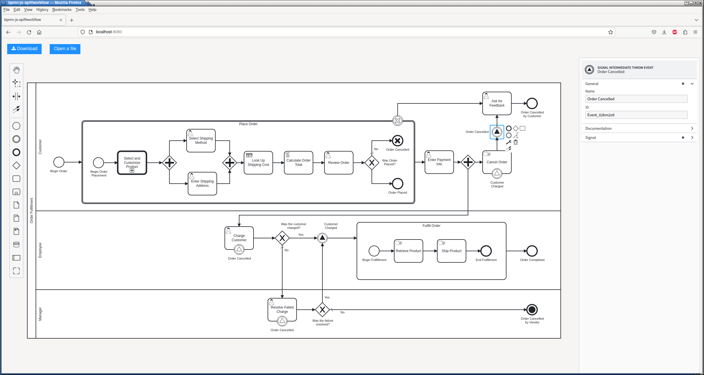
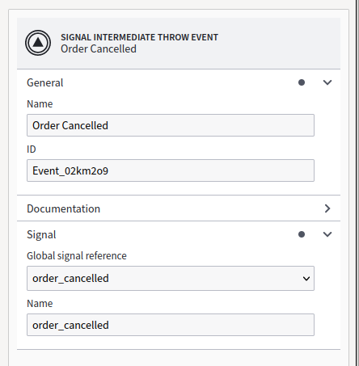
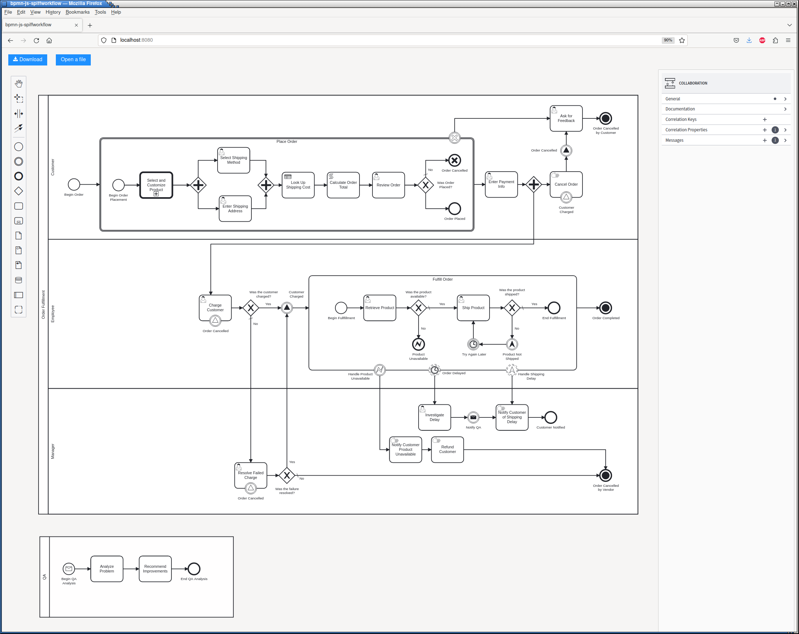
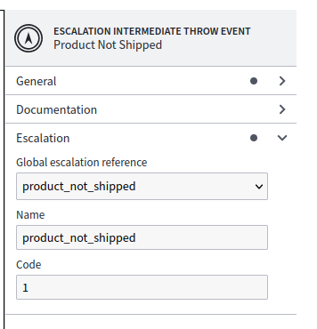
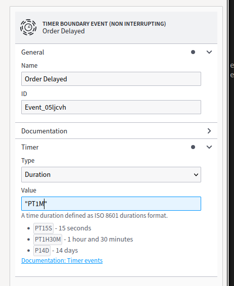
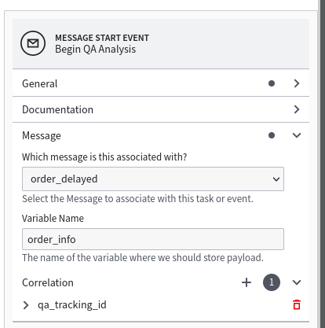

Events
======

BPMN Model
----------

We'll be using the following files from `spiff-example-cli <https://github.com/sartography/spiff-example-cli>`_.

- `transaction <https://github.com/sartography/spiff-example-cli/blob/main/bpmn/tutorial/transaction.bpmn>`_ workflow
- `signal_event <https://github.com/sartography/spiff-example-cli/blob/main/bpmn/tutorial/signal_event.bpmn>`_ workflow
- `events <https://github.com/sartography/spiff-example-cli/blob/main/bpmn/tutorial/events.bpmn>`_ workflow
- `call activity <https://github.com/sartography/spiff-example-cli/blob/main/bpmn/tutorial/call_activity.bpmn>`_ workflow
- `product_prices <https://github.com/sartography/spiff-example-cli/blob/main/bpmn/tutorial/product_prices.dmn>`_ DMN table
- `shipping_costs <https://github.com/sartography/spiff-example-cli/blob/main/bpmn/tutorial/shipping_costs.dmn>`_ DMN table

A general overview of events in BPMN can be found in the :doc:`overview`
section of the documentation.

SpiffWorkflow supports the following Event Definitions:

- `Cancel Events`_
- `Signal Events`_
- `Terminate Events`_
- `Error Events`_
- `Escalation Events`_
- `Timer Events`_
- `Message Events`_

We'll include examples of all of these types in this section.

.. note::

   SpiffWorflow can also support Multiple Event definitions, but our modeler does not allow you to create them,
   so we will not delve into them further here.

Transactions
^^^^^^^^^^^^

We also need to introduce the concept of a Transaction because certain events
can only be used in that context.  A Transaction is essentially a subprocess, but
it must fully complete before it affects its outer workflow.

We'll make our customer's ordering process through the point they review their order
into a Transaction.  If they do not complete their order, then product selections and
customizations will be discarded; if they place the order, the workflow will proceed
as before.

We'll also introduce our first event type, the Cancel Event.  Cancel Events can
only be used in Transactions.

Cancel Events
^^^^^^^^^^^^^

   Workflow with a Transaction and Cancel Event

We changed our 'Review Order' Task to be a User Task and have added a form, so
that we can give the customer the option of cancelling the order.  If the customer
answers 'Y', then the workflow ends normally and we proceed to collecting
payment information.

However, if the user elects to cancel their order, we use a 'Cancel End Event'
instead, which generates a Cancel Event.  We can then attach a 'Cancel Boundary
Event' to the Transaction, and execute that path if the event occurs.  Instead of
asking the customer for their payment info, we'll direct them to a form and ask
them why they cancelled their order.

If the order is placed, the workflow will contain the order data; if it is
cancelled, it will contain the reason for cancellation instead.

To run this workflow

.. code-block:: console

   ./spiff-bpmn-runner.py -p order_product \
        -d bpmn/tutorial/product_prices.dmn bpmn/tutorial/shipping_costs.dmn \
        -b bpmn/tutorial/transaction.bpmn bpmn/tutorial/call_activity.bpmn

Signal Events
^^^^^^^^^^^^^

   Workflow with Signal Events

Suppose we also want to give our customer the ability to cancel their order at
any time up until they are charged.  We need to throw an event after the charge
is placed and catch this event before the user completes the 'Cancel Order' task.
Once the charge is placed, the task that provides the option to cancel will
itself be cancelled when the charge event is received.

We'll also need to detect the case that the customer cancels their order and
cancel the charge task if it occurs; we'll use a separate signal for that.

Multiple tasks can catch the same signal event.  Suppose we add a Manager role
to our workflow, and allow the Employee to refer unsuccessful charges to the
Manager for resolution.  The Manager's task will also need to catch the 'Order
Cancelled' signal event.

Signals are referred to by name.

   Signal Event configuration

.. Terminate Events:

Terminate Events
^^^^^^^^^^^^^^^^

We also added a Terminate Event to the Manager Workflow.  A regular End Event
simply marks the end of a path.  A Terminate Event will indicate that the
entire workflow is complete and any remaining tasks should be cancelled.  Our
customer cannot cancel an order that has already been cancelled, and we won't ask
them for feedback about it (we know it wasn't completed), so we do not want to
execute either of those tasks.

To run this workflow

.. code-block:: console

   ./spiff-bpmn-runner.py -p order_product \
        -d bpmn/tutorial/product_prices.dmn bpmn/tutorial/shipping_costs.dmn \
        -b bpmn/tutorial/signal_event.bpmn bpmn/tutorial/call_activity.bpmn

We'll now modify our workflow to add an example of each of the other types of
events that SpiffWorkflow supports.

Error Events
^^^^^^^^^^^^

Let's turn to our order fulfillment subprocess.  Either of these steps could
potentially fail, and we may want to handle each case differently.

   Workflow with multiple event types

One potential failure is that our product is unavailable.  This actually might be
a temporary problem, but we'll assume that it is a show stopper for the sake of
this tutorial.

We ask the Employee to verify that they were able to retrieve the product; if they
were unable to do so, then we generate an Error End Event, which we will handle
with an Interrupting Error Boundary Event (Error events are *always* interrupting).

If the product is unavailable, our Manager will notify the customer, issue a refund,
and cancel the order.

Escalation Events
^^^^^^^^^^^^^^^^^

Escalation events are a lot like Error Events and as far as I can tell, which one
to use comes down to preference, with the caveat that if you want to use an Intermediate
Event, you'll have to use Escalation, because BPMN does not allow Intermediate Error Events,
and that Error Events cannot be Non-Interrupting.

In our example, we'll assume that if we failed to ship the product, we can try again later,
so, we will not end the Subprocess (Escalation events can be either Interrupting or
Non-Interrupting).

However, we still want to notify our customer of a delay, so we use a Non-Interrupting
Escalation Boundary Event.

Both Error and Escalation Events can be optionally associated with a code.  Here is
Throw Event for our `product_not_shipped` Escalation.

   Throw Escalation Event configuration

Error Event configuration is similar.

If no code is provided in a Catch event, it can be caught by any Escalation with the same
name.

Timer Events
^^^^^^^^^^^^

In the previous section, we mentioned that that we would try again later if we were unable
to ship the order.  We can use a Duration Timer Event to force our workflow to wait a certain
amount of time before continuing.  We can use this as a regular Intermediate Event (in
'Try Again Later') or a Boundary Event.  Timer Boundary Events can be Interrupting, but in
this case, we simply want to notify the customer of the delay while continuing to process
their order, so we use a Non-Interrupting Event.

   Duration Timer Event configuration

We express the duration as an ISO8601 duration.

.. note::

   We enclosed the string in quotes, because it is possible to use a variable to determine
   how long the timer should wait.

It is also possible to use a static date and time to trigger an event.  It will also need to be
specified in ISO8601 format.

Timer events can only be caught, that is waited on.  The timer begins implicitly when we
reach the event.

Message Events
^^^^^^^^^^^^^^

In BPMN, Messages are used to communicate across processes.  Technically, Messages are not
intended to be used inside a single process, but Spiff does support this use.

Messages are similar to signals, in that they are referenced by name, but they have the
additional property that they may contain a payload.  The payload is a bit of python code that will be 
evaluated against the task data and sent along with the message.  In the corresponding Message Catch 
Event or Receive Task, we define a variable name where we'll store the result.

We've added a QA process to our model, which will be initiated whenever an order takes to long
to fulfill.  We'll send the reason for the delay in the message.

Spiff Messages can also optionally use correlation keys.  The correlation key is an expression or set of
expressions that are evaluated against a message payload to create an additional identifier for associating
messages with processes.

In our example, it is possible that multiple QA processes could be started (the timer event will fire every
minute until the order fulfillment process is complete).  In this case, the message name is insufficient, as
there will be multiple processes that can accept messages based on the name.

.. figure:: figures/events/correlation.png
   :scale: 50%
   :align: center

   Defining a correlation key

We use the timestamp of the message creation as a unique key that can be used to distinguish between multiple
QA processes.

.. figure:: figures/events/throw_message_event.png
   :scale: 50%
   :align: center

   Configuring a message throw event

When we receive the event, we assign the payload to :code:`order_info`.

   Configuring a message catch event

The correlation is visible on both the Throw and Catch Events, but it is associated with the message rather
than the tasks themselves; if you update the expression on either event, the changes will appear in both places.

Running The Model
^^^^^^^^^^^^^^^^^

.. code-block:: console

   ./spiff-bpmn-runner.py -c order_collaboration \
        -d bpmn/tutorial/product_prices.dmn bpmn/tutorial/shipping_costs.dmn \
        -b bpmn/tutorial/events.bpmn bpmn/tutorial/call_activity.bpmn

.. note::

   We're specifying a collaboration rather than a process so that SpiffWorkflow knows that there is more than
   one top-level process.