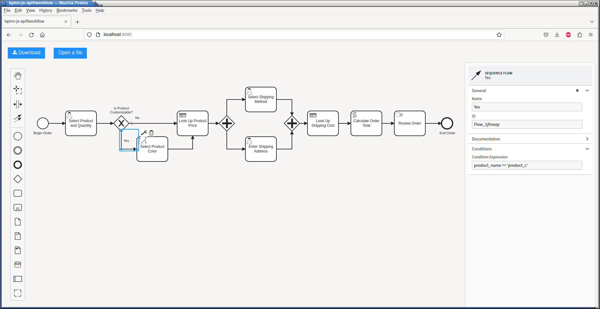
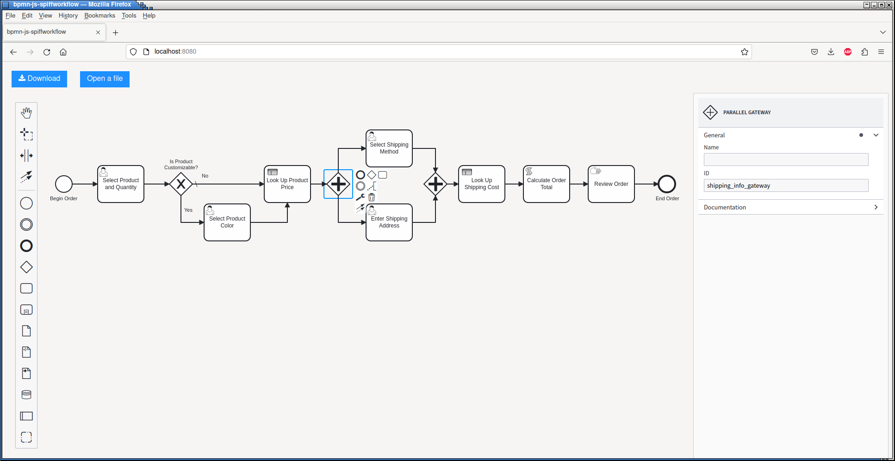

Gateways
========

BPMN Model
----------

In this section, we'll expand our model by creating alternate paths through the
workflow depending on the current workflow state, in this case, answers provided
by the user through forms.

We've also added a second DMN table to find the cost of the selected shipping
method, and we updated our order total calculations to incorporate that cost.

We'll be using the following files from `spiff-example-cli <https://github.com/sartography/spiff-example-cli>`_.

- `gateway_types <https://github.com/sartography/spiff-example-cli/blob/main/bpmn/gateway_types.bpmn>`_ workflow
- `product_prices <https://github.com/sartography/spiff-example-cli/blob/main/bpmn/product_prices.dmn>`_ DMN table
- `shipping_costs <https://github.com/sartography/spiff-example-cli/blob/main/bpmn/shipping_costs.dmn>`_ DMN table

Exclusive Gateway
^^^^^^^^^^^^^^^^^

Exclusive gateways are used when exactly one alternative can be selected.

Suppose our products are T-shirts and we offer product C in several colors.  After
the user selects a product, we check to see it if is customizable. Our default
branch will be 'Not Customizable', but we'll direct the user to a second form
if they select 'C'; our condition for choosing this branch is a simple python
expression.

   Flow configuration

Parallel Gateway
^^^^^^^^^^^^^^^^

.. sidebar:: IDs vs Names

   We've assigned descriptive names to all our tasks so far.  Text added to
   the Name field will appear in the diagram, so sometimes it's better to
   leave it blank to avoid visual clutter.  I've put a description of the
   gateway into the ID field instead.

Parallel gateways are used when the subsequent tasks do not need to be completed
in any particular order.  The user can complete them in any sequence and the
workflow will wait for all tasks to be finished before advancing.

We do not care whether the user chooses a shipping method or enters their
address first, but they'll need to complete both tasks before continuing.

We don't need to do any particular configuration for this gateway type.

   Parallel Gateway example

Inclusive Gateway
^^^^^^^^^^^^^^^^^

SpiffWorkflow also supports Inclusive Gateways, though we do not have an example of this gateway
type in this tutorial.  Inclusive Gateways have conditions on outgoing flows like Exclusive Gateways,
but unlike Exclusive Gateways, multiple paths may be taken if more than one conition is met.

Event-Based Gateway
^^^^^^^^^^^^^^^^^^^

SpiffWorkflow supports Event-Based Gateways, though we do not use them in this tutorial.  Event-Based
gateways select an outgoing flow based on an event.  We'll discuss events in the next section.

Running The Model
^^^^^^^^^^^^^^^^^

If you have set up our example repository, this model can be run with the
following command:

.. code-block:: console

   ./spiff-bpmn-runner.py -p order_product \
        -d bpmn/tutorial/product_prices.dmn bpmn/tutorial/shipping_costs.dmn \
        -b bpmn/tutorial/gateway_types.bpmn

