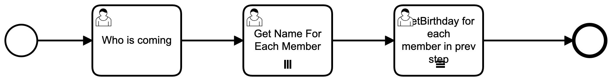

Jinja Documentation Strings
===================================

When using forms, it is often nice to have the ability to display the context of an item, for example when we are
using a multi-instance to enter the name of a bunch of people and then we need to enter the birthday for the list we
just created. If I don't have context, how do I know if I am putting in the birthday for Bob or Sally?

Luckily, we have a place to do that for BPMN.js modeler. When we click on the 'Enter Birthday for each family member
in prev step' user task, there is an 'Element Documentation' in the left hand sidebar.

If we put the following code in the documentation string, we will have a string that we can parse to provide
interactive documentation. Spiff is set up in a way that you could use any templating library you want, but we have
used Jinja for all of our examples.

Jinja is a popular templating library  (see https://jinja.palletsprojects.com/en/2.11.x/ )

.. code::

 Enter Birthday for {{  CurrentFamilyMember.FirstName }}

Returning to the sample code, when we print out the form, we use the new code listed below (as seen in
ExampleCode-multi.py)

.. code:: python
   :number-lines:

    from jinja2 import Template  # <-- Added

.. code:: python
   :number-lines: 7

    def show_form(task):
         model = {}
         form = task.task_spec.form
         docs = task.task_spec.documentation # <-- Added

         template = Template(docs)  # <-- Added
         print(task.data)
         print(template.render(task.data))  # <-- Added

This code effectively gets the documentation string we entered above from the task specification, creates a jinja
template and then uses that template paired with the current task data that we have created elsewhere.

When we are filled out the information in 'Get Name for Each Family Member' we created a collection in Family.Members

You will note that Family.Members is not typical python, it is a notation that we use to simplify entry - normal
python would be Family['Members']

In any event, we created a collection of family members, and in the task 'Enter Birthday for each family member ...'
we are using a MultiInstance for each member of that collection. The collection variable for this task is
'CurrentFamilyMember'. Because of how we filled out the form in the previous MultiInstance task, each Family member
will have a FirstName in each collection item. For each item in the collection, it will fill out CurrentFamilyMember
with the current collection item, and then we will add Birthdate to that collection item before we merge it back
into the collection.

As we run this code, when we get to the third task, the output from our example code will look something like this:

.. code::

   {'CurrentFamilyMember': {'FirstName': 'Bob'},
    'Family': {'Size': 2,
                'Members': {1: {'FirstName': 'Bob'},
                            2: {'FirstName': 'Sally'}}},
    'FamilyMember': {'FirstName': 'Bob'}}
   Enter Birthday for Bob
   Birthday?

we can see that we printed out the task.data dictionary (reformatted for clarity), the documentation string that has
been transformed by jinja to use CurrentFamilyMember.FirstName (CurrentFamilyMember['FirstName'] would work as well,
if you enjoy typing extra characters) and we can also see the label text that we entered for the form variable on the
form for the last task.

This feature is rather useful in giving end users feedback about exactly what they are filling out, especialy in the
context of a MultiInstance task, since, by nature, the MultiInstance task will be allowing users to do the one thing
multiple times, perhaps with different contexts.
