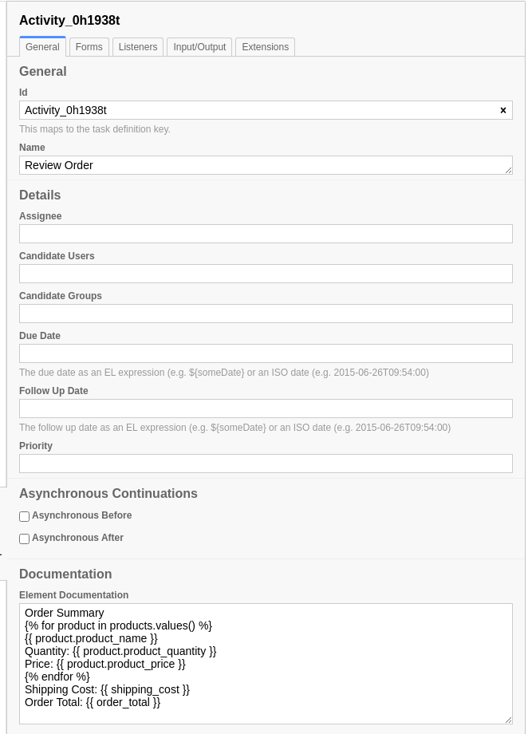
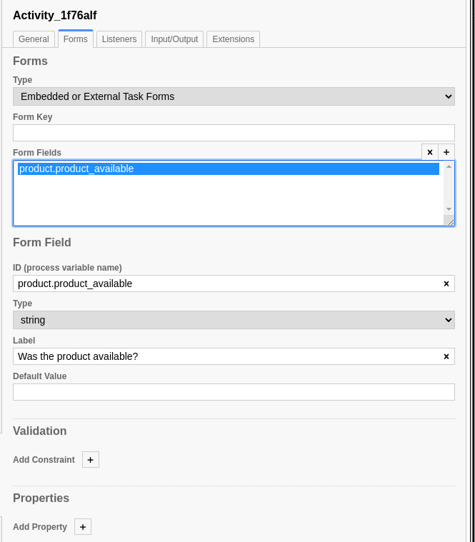
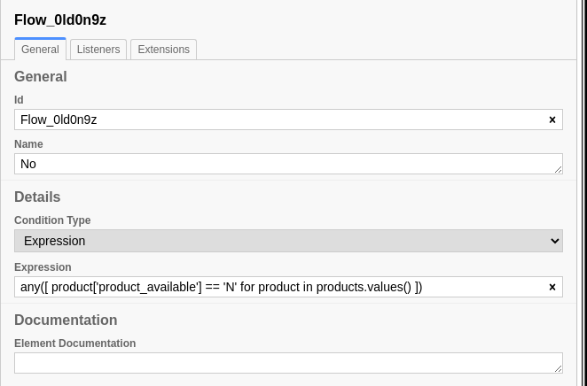

MultiInstance Tasks
===================

BPMN Model
----------

We'll be using the following files from `SpiffExample <https://github.com/sartography/SpiffExample>`_.

- `multiinstance <https://github.com/sartography/SpiffExample/bpmn/multiinstance.bpmn>`_ workflow
- `call activity multi <https://github.com/sartography/SpiffExample/bpmn/call_activity_multi.bpmn>`_ workflow
- `product_prices <https://github.com/sartography/SpiffExample/bpmn/product_prices.dmn>`_ DMN table
- `shipping_costs <https://github.com/sartography/SpiffExample/bpmn/shipping_costs.dmn>`_ DMN table

Suppose we want our customer to be able to select more than one product.

If we knew how many products they would select at the beginning of the workflow, we could
configure 'Select and Customize Product' as a Sequential MultiInstance Task.  We would
specify the name of the collection and each iteration of the task would add a new item
to it.

Since we can't know in advance how many products the order, we'll need to modify that
workflow to ask them whether they want to continue shopping and maintain their product
selections in a collection.

.. figure:: figures/call_activity_multi.png
   :scale: 30%
   :align: center

   Selecting more than one product

We'll also need to update our element docmentation to display all products.

   Updated Documentation for 'Review Order'

.. note::

   Note that we are using a dot instead of the typical python dictionary access to obtain
   the values.  Spiff automatically generates such a representation, which simplifies creating the
   documentation strings; however regular Python syntax will work as well.

Parallel MultiInstance
^^^^^^^^^^^^^^^^^^^^^^

We'll also update our 'Retrieve Product' task and 'Product Not Available' flows to
accommodate multiple products.  We can use a Parallel MultiInstance for this, since
it does not matter what order our Employee retrieves the products in.

.. figure:: figures/multiinstance_task_configuration.png
   :scale: 30%
   :align: center

   MultiInstance task configuration

Spiff will generate a task for each of the items in the collection.  Because of the way
SpiffWorkflow manages the data for these tasks, the collection MUST be a dictionary.

Each value in the dictionary will be copied into a variable with the name specified in
the 'Element Variable' field, so you'll need to specify this as well.

   MultiInstance form configuration

We'll also need to update the form field id so that the results will be added to the
item of the collection rather than the top level of the task data.  This is where the
'Element Variable' field comes in: we'll need to change `product_available` to
`product.product_available`, because we set up `product` as our reference to the
current item.

   Product available flow configuration

Finally, we'll need to update our 'No' flow to check all items in the collection for
availability.

.. note::

   In our form configuration, we used `product.product_available` but when we reference
   it in the flow, we use the standard python dictionary syntax.  We can't use that
   notation in form fields, so in this case we need to use SpiffWorkflow's dot notation
   conversion.

Sequential MultiInstance
^^^^^^^^^^^^^^^^^^^^^^^^

SpiffWorkflow also supports Sequential MultiInstance Tasks for previously defined
collections, or if the loopCardinality is known in advance, although we have not added an
example of this to our workflow.

For more information about MultiInstance Tasks and SpiffWorkflow, see :doc:`/bpmn/advanced`.

Running The Model
^^^^^^^^^^^^^^^^^

If you have set up our example repository, this model can be run with the
following command:

.. code-block:: console

   ./run.py -p order_product \
        -d bpmn/product_prices.dmn bpmn/shipping_costs.dmn \
        -b bpmn/multiinstance.bpmn bpmn/call_activity_multi.bpmn

