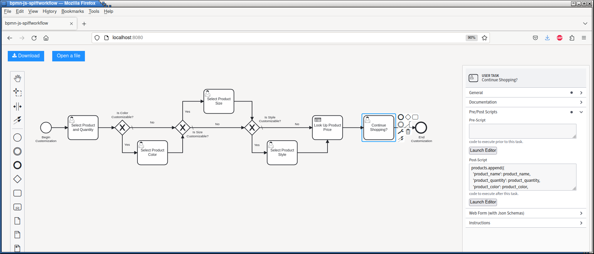
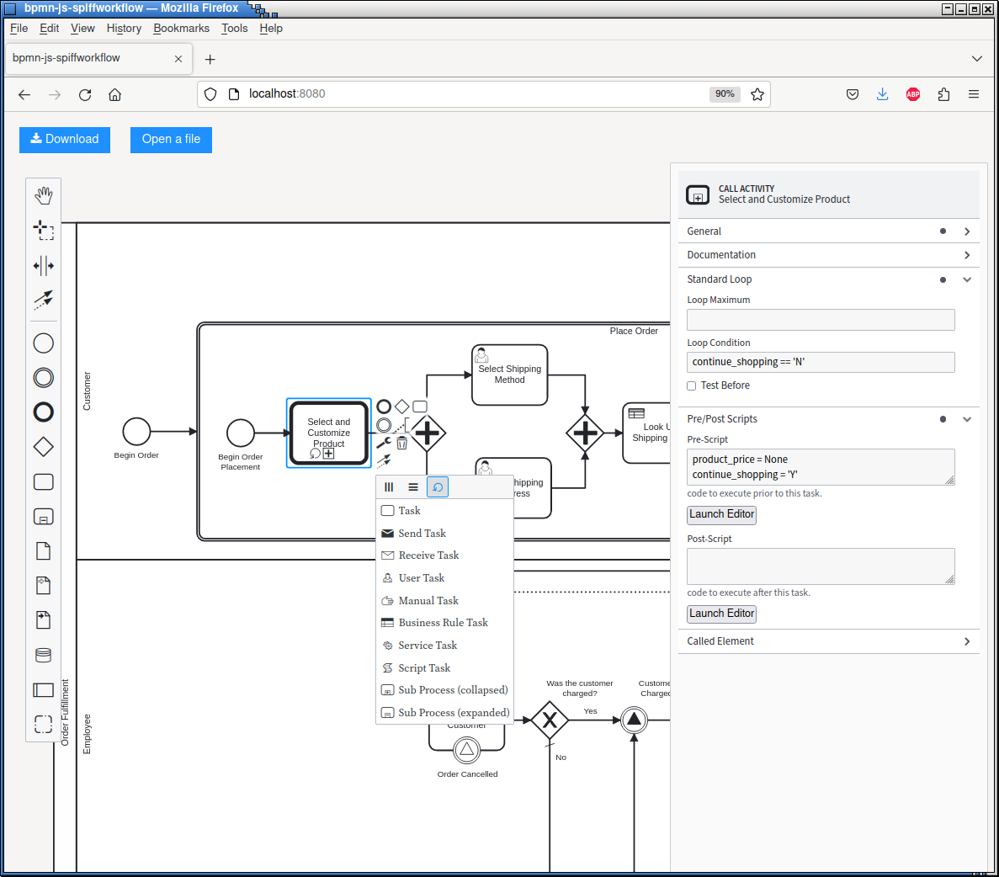
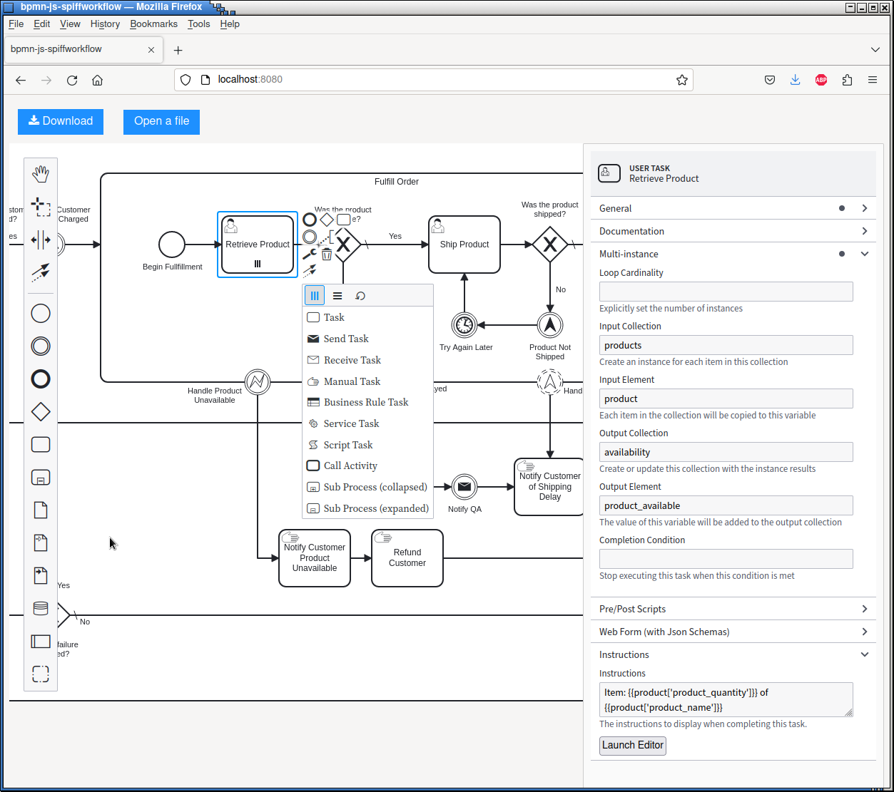
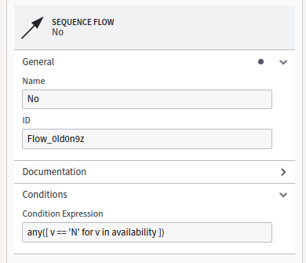

MultiInstance Tasks
===================

BPMN Model
----------

We'll be using the following files from `spiff-example-cli <https://github.com/sartography/spiff-example-cli>`_.

- `multiinstance <https://github.com/sartography/spiff-example-cli/blob/main/bpmn/tutorial/top_level_multi.bpmn>`_ workflow
- `call activity multi <https://github.com/sartography/spiff-example-cli/blob/main/bpmn/tutorial/call_activity_multi.bpmn>`_ workflow
- `product_prices <https://github.com/sartography/spiff-example-cli/blob/main/bpmn/tutorial/product_prices.dmn>`_ DMN table
- `shipping_costs <https://github.com/sartography/spiff-example-cli/blob/main/bpmntutorial//shipping_costs.dmn>`_ DMN table

Loop Task
^^^^^^^^^

Suppose we want our customer to be able to select more than one product.

We'll run our 'Select and Customize Product' Call Activity as a Loop Task.

First we'll update the Call Activity's model to ask the customer if they would like to continue shopping.

   Selecting more than one product

We've also added a *postScript* to the user task.  Spiffworkflow provides extensions that allow scripts to be
run before and after tasks.  It is often the case that data needs to be manipulated before and after a task.
We could add regular script tasks before and after, but diagrams quickly become cluttered with scripts, and
these extensions are intended to alleviate that.

We use a postscript to add the current product to a list of products.

.. code:: python

   products.append({
   'product_name': product_name,
   'product_quantity': product_quantity,
   'product_color': product_color,
   'product_size': product_size,
   'product_style': product_style,
   'product_price': product_price,
   })

We'll use a prescript on the first User Task (Select Product and Quantity) to initialize these variables to
:code:`None` each time we execute the task.

Loop Tasks run either a specified number of times or until a completion condition is met.  Since we can't
know in advance how many products the customer will select, we'll add :code:`continue_shopping == 'Y'` as a 
completion condition.  We'll re-run this Call Activity as long as the customer indicates they want to choose
another product.  We'll also set up the list of products that we plan on appending to.

We also added a postscript to this activity to delete the customization values so that we won't have to
look at them for the remainder of the workflow.

   Call Activity with Loop

We also needed to update our Script Task and the Instructions of the Review Order Task to handle an array
of products rather than a single product.

Here is our new script

.. code:: python

   order_total = sum([ p['product_quantity'] * p['product_price'] for p in products ]) + shipping_cost

And our order summary

.. code:: python

   Order Summary
   
   {{ product['product_name'] }}
   Quantity: {{ product['product_quantity'] }}
   Price: {{ product['product_price'] }}
   
   Shipping Cost: {{ shipping_cost }}
   Order Total: {{ order_total }}

Parallel MultiInstance
^^^^^^^^^^^^^^^^^^^^^^

We'll also update our 'Retrieve Product' task and 'Product Not Available' flows to
accommodate multiple products.  We can use a Parallel MultiInstance for this, since
it does not matter what order our Employee retrieves the products in.

   MultiInstance task configuration

We've specified :code:`products` as our Input Collection and :code:`product` as our Input Item.  The
Input Collection should be an existing collection.  We'll create a task instance for each element of
the collection, and copy the value into the Input Item; this is how we'll access the data of the
element.

.. :code::

   Item: {{product['product_quantity']}} of {{product['product_name']}}

We also specified :code:`availability` as our Output Collection.  Since this variable does not exist,
SpiffWorkflow will automatically create it.  You can use an existing variable as an Output Collection;
in this case, its contents will be updated with new values.  The Output Item will be copied out of the
child task into the Output Collection.

The 'Retrieve Product' task creates :code:`product_available` from the form input.

Since our input is a list, our output will also be a list.  It is possible to generate different output
types.  See the :doc:`advanced` section for more details.

We have to update our gateway condition to handle the list:

   Gateway Condition

Sequential MultiInstance
^^^^^^^^^^^^^^^^^^^^^^^^

SpiffWorkflow also supports Sequential MultiInstance Tasks for previously defined
collections, or if the loopCardinality is known in advance, although we have not added an
example of this to our workflow.

For more information about MultiInstance Tasks and SpiffWorkflow, see :doc:`/bpmn/advanced`.

Running The Model
^^^^^^^^^^^^^^^^^

If you have set up our example repository, this model can be run with the following command:

.. code-block:: console

   ./spiff-bpmn-runner.py -p order_product \
      -d bpmn/tutorial/product_prices.dmn bpmn/tutorial/shipping_costs.dmn \
      -b bpmn/tutorial/top_level_multi.bpmn bpmn/tutorial/call_activity_multi.bpmn
