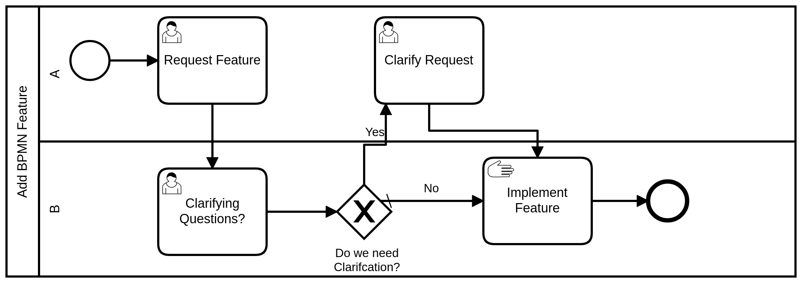

Choosing Lane Specific Tasks
===================================

Lets take a look at a sample workflow with lanes:

and lets say that we would like to have two separate processes, one that shows the steps for only for the A role, and
one that shows only tasks for the B role.

Up until now, we have just asked the workflow processor for any ready tasks, but it is possible to ask the workflow
processor for just those tasks that are for a specific lane. Please note that this feature will only work for those
situations where you have set up a workflow with lanes

.. tip:: Workflows with 'pools'

  When you add lanes to a BPMN document, those lanes are contained within a 'pool' That pool has its own process
  ID. To activate the workflow inside of a pool, you need to use the process id for the pool and not the workflow
  document itself as we have in previous workflows. In the workflow above, the main workflow ID is lanes_outer, and
  the processid on the pool is 'lanes' - so we would use 'lanes' in the 'get_spec' line of code to interact with this
  workflow.

To get all of the tasks that are ready for the 'A' workflow, we would use the same

.. code:: python

     ready_tasks = workflow.get_ready_user_tasks()

but we would change it to do the following:

.. code:: python

     ready_tasks = workflow.get_ready_user_tasks(lane='A')

If there were no tasks ready for the 'A' lane, you would get an empty list, and of course if you had no lane that was
labeled 'A' you would *always* get an empty list.

This is all well and good, but what if you want to give a user that is in either the 'A' or 'B' role a sense of where
things were at in the workflow?  Spiff workflow gives us a 'Nav List' that allows us to convey a sort of 'roadmap' to
the user no matter if they are using lanes or not.

Nav(igation) List
=================

.. sidebar:: Warning!

  At the time of writing, the nav list does have some issues. The main issue is that there are 'issues' with showing
  the tasks for a subprocess. For most self-contained workflows, the nav-list does a good job of showing all of the
  events that are coming up and where a user is at in the process. Another set of features that have not been tested
  with the navigation list are any kind of boundary events which may cause a non-linear flow which would be hard to
  render.

In order to get the navigation list, we can call the workflow.get_nav_list() function. This will return a list of dictionaries with information about each task and decision point in the workflow. Each item in this list returns some information about the tasks that are in the workflow, and how it relates to the other tasks.

To give you an idea of what is in the list I'll include a segment from the documentation::

               id               -   TaskSpec or Sequence flow id
               task_id          -   The uuid of the actual task instance, if it exists.
               name             -   The name of the task spec (or sequence)
               description      -   Text description
               backtracks       -   Boolean, if this backtracks back up the list or not
               level            -   Depth in the tree - probably not needed
               indent           -   A hint for indentation
               child_count       -   The number of children that should be associated with
                                    this item.
               lane             -   This is the swimlane for the task if indicated.
               state            -   Text based state (may be half baked in the case that we have
                                    more than one state for a task spec - but I don't think those
                                    are being reported in the list, so it may not matter)
                Any task with a blank or None as the description are excluded from the list (i.e. gateways)

Because the output from this list may be used in a variety of contexts, the implementation is left to the user, however, we do have some example code that creates a text based representation of the nav-list.

The example code for this lives in 'testlanes.py' and runs the above workflow. The code to print the nav-list is in the printTaskTree function

.. code:: python
   :number-lines: 41

   def printTaskTree(tree,currentID,data):
        print("\n\n\n")
        print("Current Tree")
        print("-------------")
        lookup = {'COMPLETED':'* ',
                  'READY':'> ',
                  'LIKELY':'0 ',
                  'NOOP': '  '
                  }
        for x in tree:
            if x['id'] == currentID:
                print('>>', end='')
            else:
                print(lookup.get(x['state'],'O '),end='')
            print("  "*x['indent'], end='')
            print(x['description'], end = '')
            if x['task_id'] is not None:
                print(' ---> ',end='')
                print(str(x['lane']),end='')
            if x.get('is_decision') and x.get('backtracks') is not None:
                print()
                print('  ' * x['indent'] + '   Returns to '+x['backtracks'][1],end='')
            elif x.get('is_decision') and x.get('child_count',0)==0:
                print()
                print('  '*x['indent']+'   Do Nothing', end='')
            print()
        print('\n\nCurrent Data')
        print('-----------------')
        print(str(data),end='')
        print('\n\nReady Tasks')
        print('-----------------')

        for lane in ['A','B']:
            print(lane+' Tasks')
            for x in workflow.get_ready_user_tasks(lane=lane):
                print('    ' + x.get_name())
        print('\n\n\n')

This code prints to the screen each time the code progresses and prints something like this:

.. code::

   Current Tree
   -------------
   * Request Feature ---> A
   * Clarifying Questions? ---> B
   * Do we need Clarifcation? --->  B
       Yes
   O     Clarify Request
       No
         Do Nothing
   >>Implement Feature ---> B

   Current Data
   -----------------
   {'NewBPMNFeautre': 'Something new', 'NeedClarification': 'no'}

   Ready Tasks
   -----------------
   A Tasks
   B Tasks
      Activity_B2

If we look at the internals of the bpmn diagram, we can see that the last task that has the description 'Implement
Feature' has the ID of Activity_B2, so the list above shows us that we are currently on the 'Implement Feature' task,
that we have completed 'Request Feature', 'Clarifying Questions?' and the gateway 'Do We need Clarifications?' - and
that we did not ask to clarify the request.  It is also showing us the data we have collected so far in task.data
which gets propagated down the workflow as we complete tasks.

