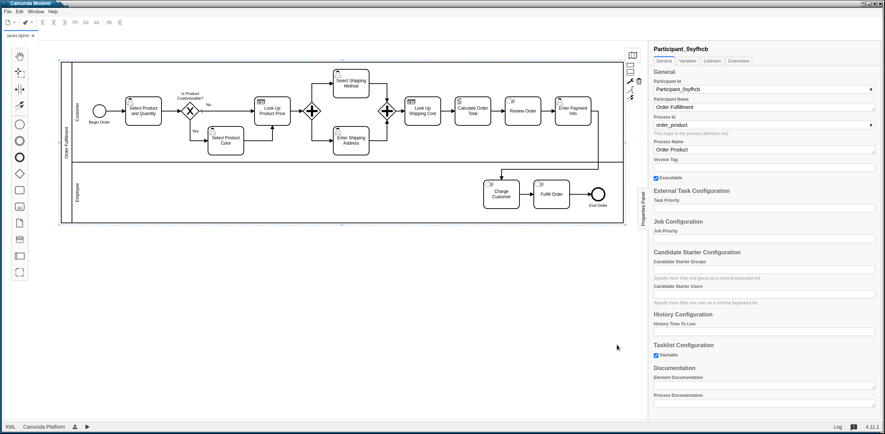
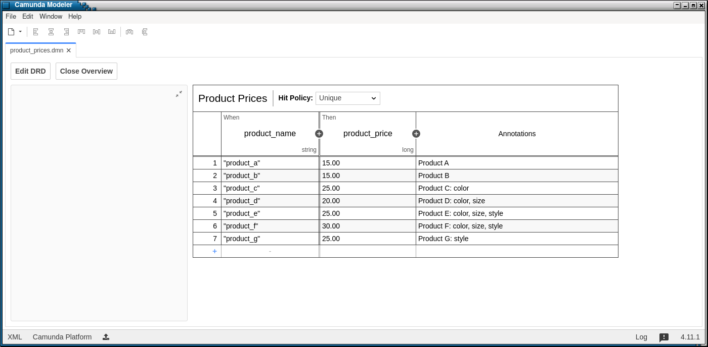
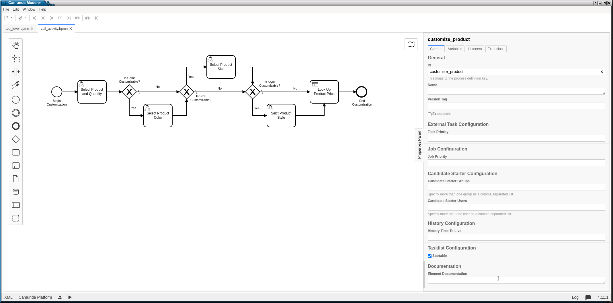
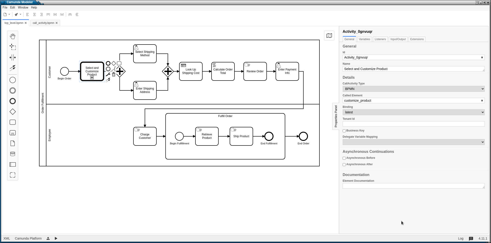

Organizing More Complex Workflows 
=================================

BPMN Model
----------

We'll be using the the `lanes 
<https://github.com/sartography/SpiffExample/bpmn/lanes.bpmn>`_, `top_level 
<https://github.com/sartography/SpiffExample/bpmn/top_level.bpmn>`_, and
`call_activity <https://github.com/sartography/SpiffExample/bpmn/lanes.bpmn>`_
workflows, as well as the `product_prices 
<https://github.com/sartography/SpiffExample/bpmn/product_prices.dmn>`_
and `shipping_costs <https://github.com/sartography/SpiffExample/bpmn/shipping_costs.dmn>`_
DMN tables from `SpiffExample <https://github.com/sartography/SpiffExample>`_.

Lanes
^^^^^

Lanes are a method in BPMN to distinguish roles for the workflow and who is
responsible for which actions. In some cases this will be different business
units, and in some cases this will be different individuals - it really depends
on the nature of the workflow.  Within a BPMN editor, this is done by choosing the
'Create pool/participant' option from the toolbar on the left hand side.

We'll modify our workflow to get the customer's payment information and send it
to an employee who will charge the customer and fulfill the order.

   Workflow with lanes

Running the `lanes workflow`_.

For a simple example of displaying a tasks lane, see `Handling Lanes`_

Subprocesses
^^^^^^^^^^^^

In general, subprocesses are a way of grouping work into smaller units. This, in 
theory, will help us to re-use sections of business logic, but it will also allow 
us to treat groups of work as a unit.

Subprocesses come in two different flavors. In this workflow we see an 'expanded' 
subprocess.  Unfortunately, we can't collapse an expanded subprocess within BPMN.js, 
so expanded subprocesses are mainly useful for conceptualizing a group of tasks as
a unit.  

It also possible to refer to external subprocesses via a Call Activity Task. This 
allows us to 'call' a separate workflow in a different file by referencing the ID of 
the called workflow. This allows us to simplify and re-use business logic.

We'll expand 'Fulfill Order' into sub tasks -- retrieving the product and shipping 
the order -- and create an Expanded Subprocess.

We'll also expand our selection of products, adding several new products and the ability
to customize certain products by size and style in addition to color.

   Updated Product List

Since adding gateways for navigating the new options will add a certain amount of 
clutter to our diagram, we'll create a separate workflow around selecting and 
customizing products and refer to that in our main workflow.

When configuring the subworkflow, we need to make sure the 'CallActivity Type' of the
parent workflow is 'BPMN' and the 'Called Element' matches the id we assigned in the
subworkflow.

   Subworkflow for product selection

   Parent workflow

Running the `subprocesses workflow`_.

Running The Models
------------------

Lanes Workflow
^^^^^^^^^^^^^^

.. code-block:: console

   ./run.py -p order_product \
        -d bpmn/product_prices.dmn bpmn/shipping_costs.dmn \
        -b bpmn/lanes.bpmn

Subprocesses Workflow
^^^^^^^^^^^^^^^^^^^^^

.. code-block:: console

   ./run.py -p order_product \
        -d bpmn/product_prices.dmn bpmn/shipping_costs.dmn \
        -b bpmn/top_level.bpmn bpmn/call_activity.bpmn

Example Application Code
------------------------

Handling Lanes
^^^^^^^^^^^^^^

We are not required to handle lanes in our application, but most of the time we'll
probably want a way of filtering on lanes and selectively displaying tasks.  In
our sample application, we'll simple display which lane a task belongs to.

.. code:: python

    if hasattr(task.task_spec, 'lane') and task.task_spec.lane is not None:
        lane = f'[{task.task_spec.lane}]' 
    else:
        lane = ''

The tasks lane can be obtained from :code:`task.task_spec.lane`.  Not all tasks
will have a :code:`lane` attribute, so we need to check to make sure it exists
before attempting to access it (this is true for many task attributes).

See the Working With Lanes Section of Features in More Depth for more information
about working with lanes in Spiff.
