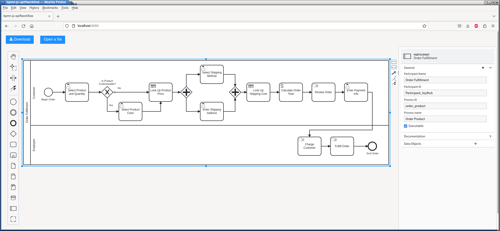
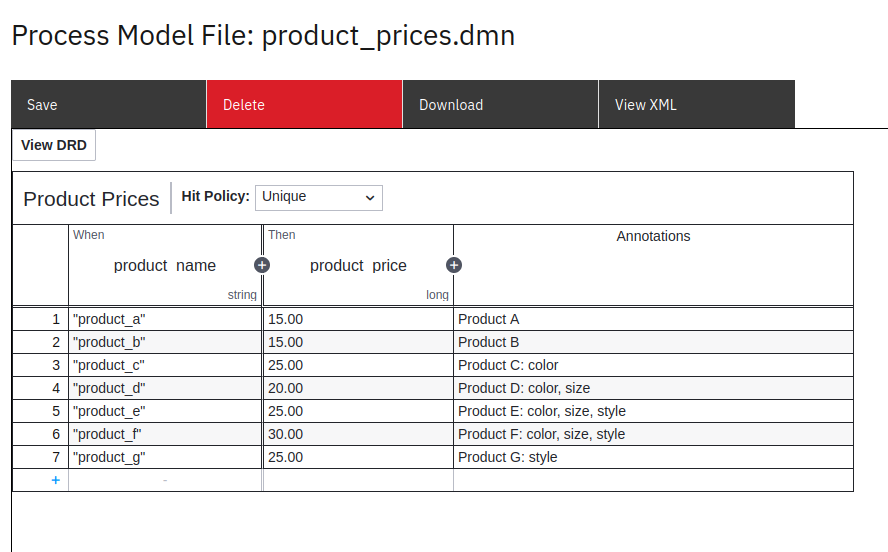
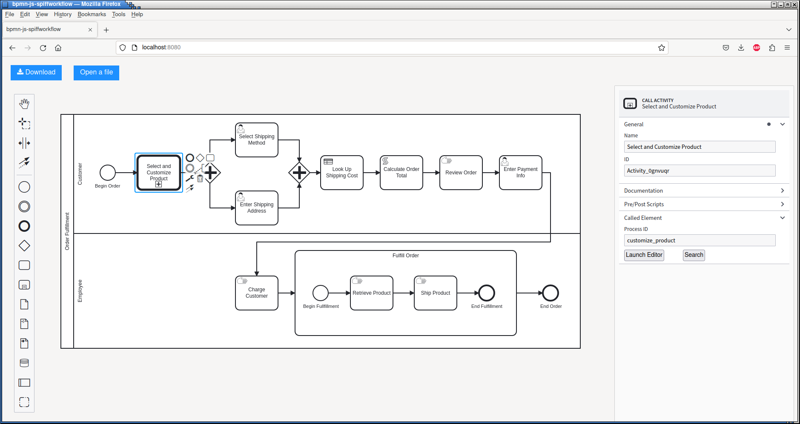

Organizing More Complex Workflows
=================================

BPMN Model
----------

We'll be using the following files from `spiff-example-cli <https://github.com/sartography/spiff-example-cli>`_.

- `lanes <https://github.com/sartography/spiff-example-cli/blob/main/tutorial/bpmn/lanes.bpmn>`_ workflow
- `top_level <https://github.com/sartography/spiff-example-cli/blob/main/bpmn/tutorial/top_level.bpmn>`_ workflow
- `call_activity <https://github.com/sartography/spiff-example-cli/blob/main/tutorial/bpmn/call_activity.bpmn>`_ workflow
- `product_prices <https://github.com/sartography/spiff-example-cli/blob/main/tutorial/bpmn/product_prices.dmn>`_ DMN table
- `shipping_costs <https://github.com/sartography/spiff-example-cli/blob/main/bpmn/tutorial/shipping_costs.dmn>`_ DMN table

Lanes
^^^^^

Lanes are a method in BPMN to distinguish roles for the workflow and who is
responsible for which actions. In some cases this will be different business
units, and in some cases this will be different individuals - it really depends
on the nature of the workflow.  Within a BPMN editor, this is done by choosing the
'Create pool/participant' option from the toolbar on the left hand side.

We'll modify our workflow to get the customer's payment information and send it
to an employee who will charge the customer and fulfill the order.

   Workflow with lanes

To run this workflow

.. code-block:: console

   ./spiff-bpmn-runner.py -p order_product \
        -d bpmn/tutorial/product_prices.dmn bpmn/tutorial/shipping_costs.dmn \
        -b bpmn/tutorial/lanes.bpmn

For a simple code example of displaying a tasks lane, see `Handling Lanes`_

Subprocesses
^^^^^^^^^^^^

In general, subprocesses are a way of grouping work into smaller units. This, in
theory, will help us to re-use sections of business logic, but it will also allow
us to treat groups of work as a unit.

Subprocesses come in two different flavors.  We can create a Subprocess Task, which can be
expanded or collapsed.  The difference between the two types is visual rather than functional.
The purpose of a Subprocess Task is to conceptualize a group of tasks as a unit.

It also possible to refer to external processes via a Call Activity Task. This
allows us to 'call' a separate workflow in a different file by referencing the ID of
the called workflow, which can simplify business logic and make it re-usable.

We'll expand 'Fulfill Order' into sub tasks -- retrieving the product and shipping
the order -- and create an Expanded Subprocess.

We'll also expand our selection of products, adding several new products and the ability
to customize certain products by size and style in addition to color.

   Updated Product List

.. note::

   I've added what customizations are available for each product in the 'Annotations'
   column of the DMN table.  This is not actually used by Spiff; it simply provides
   the option of documenting the decisions contained in the table.

Since adding gateways for navigating the new options will add a certain amount of
clutter to our diagram, we'll create a separate workflow around selecting and
customizing products and refer to that in our main workflow.

.. figure:: figures/organization/call_activity.png
   :scale: 30%
   :align: center

   Subworkflow for product selection

We need to make sure the 'Called Element' matches the ID we assigned in the called process.

   Parent workflow

Running the Model
^^^^^^^^^^^^^^^^^

.. code-block:: console

   ./spiff-bpmn-runner.py -p order_product \
        -d bpmn/tutorial/product_prices.dmn bpmn/tutorial/shipping_costs.dmn \
        -b bpmn/tutorial/top_level.bpmn bpmn/tutorial/call_activity.bpmn

Example Application Code
------------------------

Handling Lanes
^^^^^^^^^^^^^^

We are not required to handle lanes in our application, but most of the time we'll
probably want a way of filtering on lanes and selectively displaying tasks.  In
our sample application, we'll simply display which lane a task belongs to.

.. code:: python

    def get_task_description(self, task, include_state=True):

        task_spec = task.task_spec
        lane = f'{task_spec.lane}' if task.task_spec.lane is not None else '-'
        name = task_spec.bpmn_name if task_spec.bpmn_name is not None else '-'
        state = f'{task.get_state_name()}' if include_state else ''
        return f'[{lane}] {name} ({task_spec.bpmn_id}) {state}'

The tasks lane can be obtained from :code:`task.task_spec.lane`, which will be :code:`None`
if the task is not part of a lane.

See the Filtering Tasks Section of :doc:`advanced` more information
about working with lanes in Spiff.
