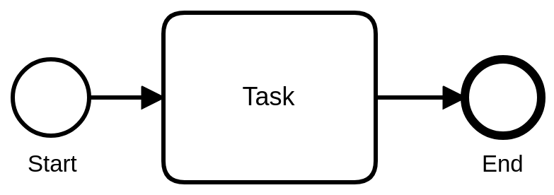
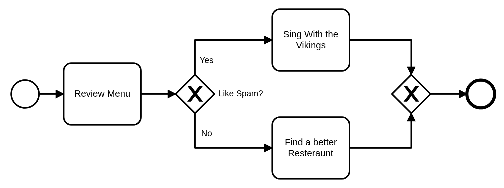
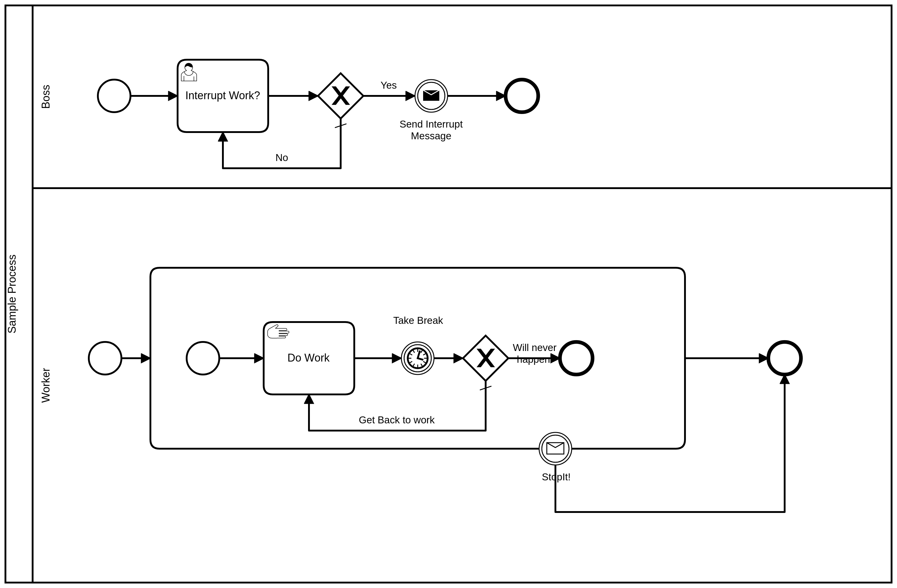

Overview
========

BPMN and SpiffWorkflow
----------------------

.. sidebar:: BPMN Resources

  This guide is a mere introduction to BPMN.
  For more serious modeling, we recommend looking for more comprehensive
  resources. We have used the `books by Bruce Silver <https://www.amazon.com/Bruce-Silver/e/B0062AXUFY/ref=dp_byline_cont_pop_book_1>`_
  as a guide for our BPMN modeling.

  .. image:: figures/overview/bpmnbook.jpg
     :align: center

Business Process Model and Notation (BPMN) is a diagramming language for specifying business
processes. BPMN links the realms of business and IT, and creates a common process language that
can be shared between the two.

BPMN describes details of process behaviors efficiently in a diagram. The meaning is precise enough
to describe the technical details that control process execution in an automation engine. 
SpiffWorkflow allows you to create code to directly execute a BPMN diagram.

When using SpiffWorkflow, a client can manipulate the BPMN diagram and still have their product work
without a need for you to edit the Python code, improving response and turnaround time.

.. sidebar:: BPMN Modelers

  There are a number of modelers in existence, and any BPMN compliant modeler should work.
  SpiffWorkflow has some basic support for the free Camunda modeler, in particular, its
  form building capabilities.

  Our `modeler <https://github.com/sartography/bpmn-js-spiffworkflow>`_ provides several,
  extensions, including form specifications via JSON Schema.

Today, nearly every process modeling tool supports BPMN in some fashion making it a great tool to
learn and use.  This page provides a brief overview, and the following section provides a more 
in-depth look. There are many resources for additional information about BPMN.

Most of the examples in this guide have been created with our modeler, which is based on the
`BPMN.js <https://github.com/sartography/bpmn-js-spiffworkflow>`_ BPMN Modeler.

A Simple Workflow
-----------------

All BPMN models have a start event and at least one end event. The start event
is represented with a single thin border circle. An end event is represented
by a single thick border circle.

The following example also has one task, represented by the rectangle with curved corners.

   A simple workflow.

The sequence flow is represented with a solid line connector. When the node at
the tail of a sequence flow completes, the node at the arrowhead is enabled to start.

A More Complicated Workflow
---------------------------

   A workflow with a gateway

In this example, the diamond shape is called a gateway. It represents a branch
point in our flow.  This gateway is an exclusive data-based gateway (also
called an XOR gateway). With an exclusive gateway, you must take one path or
the other based on some data condition. BPMN has other gateway types.

The important point is that we can use a gateway to add a branch in the
workflow **without** creating an explicit branch in our Python code.

Events
------

In the above simple workflows, all of the transitions are deterministic and we
have direct connections between tasks.  We need to handle the cases where an event
may or may not happen and link these events in different parts of the workflow or
across different workflows.

BPMN has a comprehensive suite of event elements that can used for this purpose.
SpiffWorkflow does not support every single BPMN event type, but it can handle
many of them.

   A workflow containing events

We've already seen plain Start and End Events.  BPMN also include the concepts
of Intermediate Events (standalone events that may be Throwing or Catching) as well
as Boundary Events (which are exclusively Catching).

All Start Events are inherently Catching Events (a workflow can be initiated if a
particular event occurs) and all End Events are Throwing Events (they can convey
the final state of a workflow or path to other tasks and workflows).

If an Intermediate Throwing Event is added to a flow, the event it represents
will be generated and the flow will continue immediately.  If an Intermediate
Catching Event is added to a flow, the workflow will wait to catch the event it
represents before advancing.

A Boundary Event represents an event that may be caught only while a particular task
is being executed and comes in two types: Interrupting (in which case the task it is
attached to will be cancelled if the event is received) or Non-Interrupting (in
which case the task will continue).  In both cases, flows may emanate from the
Boundary Event, which will trigger those paths if the events occur while the task
is being executed.
