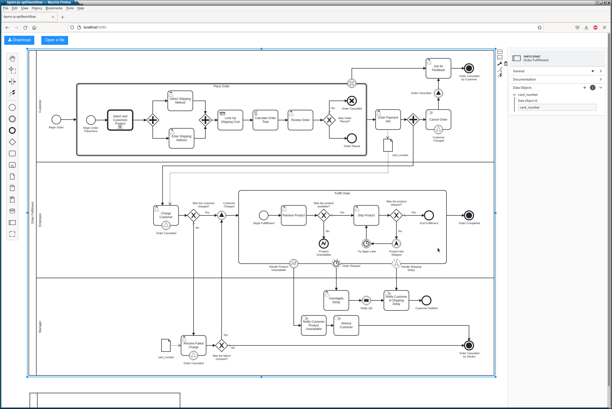
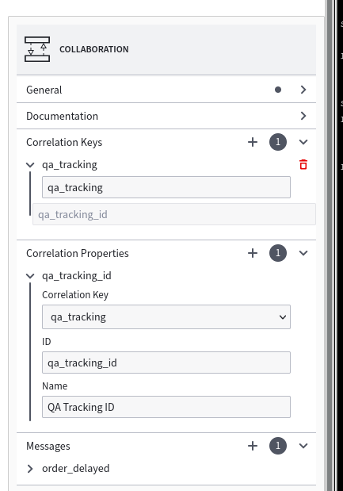
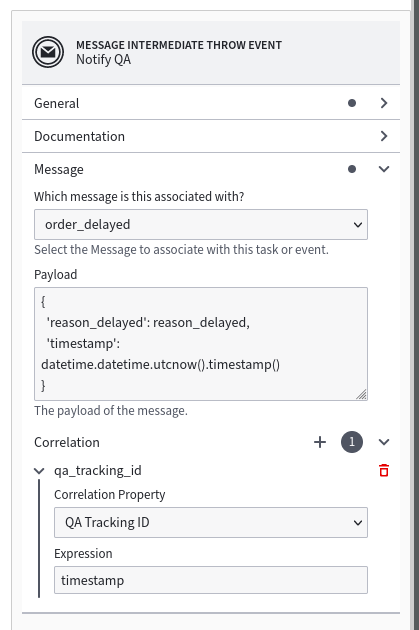

Spiff Extensions
================

BPMN Model
----------

We'll be using the following files from `spiff-example-cli <https://github.com/sartography/spiff-example-cli>`_.

- `bpmn-spiff/events <https://github.com/sartography/spiff-example-cli/blob/master/bpmn-spiff/events.bpmn>`_ workflow
- `bpmn-spiff/call activity <https://github.com/sartography/spiff-example-cli/blob/master/bpmn-spiff/call_activity.bpmn>`_ workflow
- `product_prices <https://github.com/sartography/spiff-example-cli/blob/master/bpmn/product_prices.dmn>`_ DMN table
- `shipping_costs <https://github.com/sartography/spiff-example-cli/blob/master/bpmn/shipping_costs.dmn>`_ DMN table

We'll also be using the `run-spiff.py <https://github.com/sartography/spiff-example-clie/blob/master/run-spiff.py>`_ script
instead of the `run.py <https://github.com/sartography/spiff-example-clie/blob/master/run.py>`_ script

Camunda's BPMN editor does not handle data objects in the expected way.  You can create data object
references, but there is no way to re-use data objects.

It also does not support Message Correlations, and the interface for generating a message payload doesn't work
well in a Python environment.

We have extended BPMN.js to correct some of these issues.  The examples in this section were created using our
custom BPMN editor, `bpmn-js-spiffworkflow <https://github.com/sartography/bpmn-js-spiffworkflow>`_.

Data Objects
^^^^^^^^^^^^

 Data objects exist at a process level and are not visible in the diagram, but when you create a data object
 reference, you can choose what data object it points to.

.. figure:: figures/data_object_configuration.png
   :scale: 50%
   :align: center

   Configuring a data object reference

When a data output association (a line) is drawn from a task to a data object reference, the value is copied
from the task data to the workflow data and removed from the task.  If a data input association is created from
a data object reference, the value is temporarily copied into the task data while the task is being executed,
and immediate removed afterwards.

This allows sensitive data to be removed from individual tasks (in our example, the customer's credit card
number).  It can also be used to prevent large objects from being repeatedly copied from task to task.

Multiple data object references can point to the same underlying data.  In our example, we use to references
to the same data object to pass the credit card info to both tasks that require it.  On the right panel, we can
see that only one data object exists in the process.

   Data objects in a process

If you step through this workflow, you'll see that the card number is not contained in the task data after
the 'Enter Payment Info' has been completed.

Configuring Messages
^^^^^^^^^^^^^^^^^^^^

Messages are handled slightly differently in Spiff Message Events.  On a Message Throw Event or Send Task,
we define a payload, which is simply a bit of python code that will be evaluated against the task data and
sent along with the message.  In the corresponding Message Catch Event or Receive Task, we define a
variable name where we'll store the result.

Spiff Messages can also optionally use correlation keys.  The correlation key is an expression or set of
expressions that are evaluated against a message payload to create an additional identifier for associating
messages with processes.

In our example, it is possible that multiple QA processes could be started (the timer event will fire every
minute until the order fulfillment process is complete).  In this case, the message name is insufficient, as
there will be multiple processes that can accept messages based on the name.

   Defining a correlation key

We use the timestamp of the message creation as a unique key that can be used to distinguish between multiple
QA processes.

   Configuring a message throw event

When we receive the event, we assign the payload to :code:`order_info`.

.. figure:: figures/spiff_message_catch.png
   :scale: 50%
   :align: center

   Configuring a message catch event

The correlation is visible on both the Throw and Catch Events, but it is associated with the message rather
than the tasks themselves; if you update the expression on either event, the changes will appear in both places.

Running The Model
^^^^^^^^^^^^^^^^^

If you have set up our example repository, this model can be run with the
following command:

.. code-block:: console

   ./run-spiff.py -p order_product \
        -d bpmn/product_prices.dmn bpmn/shipping_costs.dmn \
        -b bpmn-spiffevents.bpmn bpmn-spiff/call_activity.bpmn

