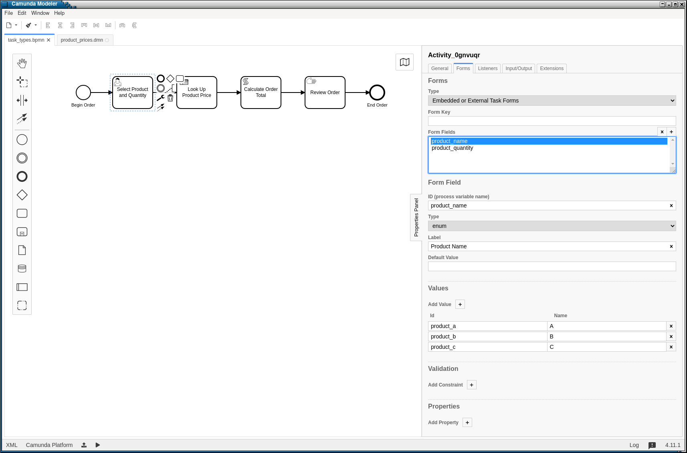
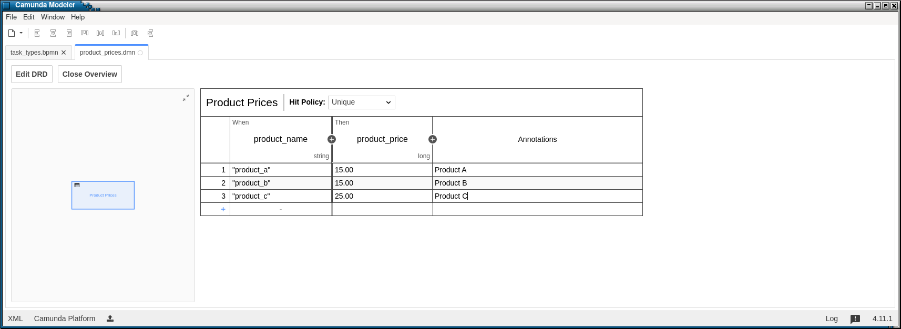
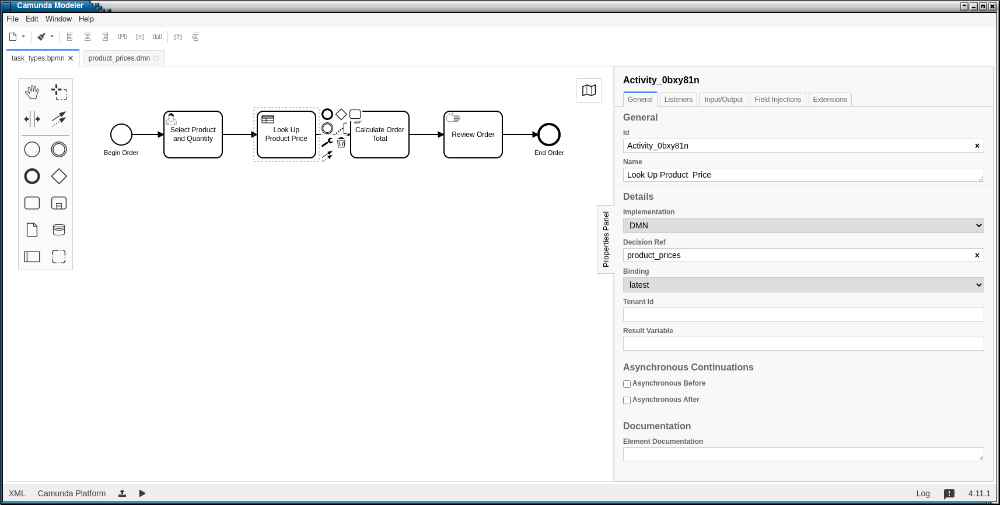
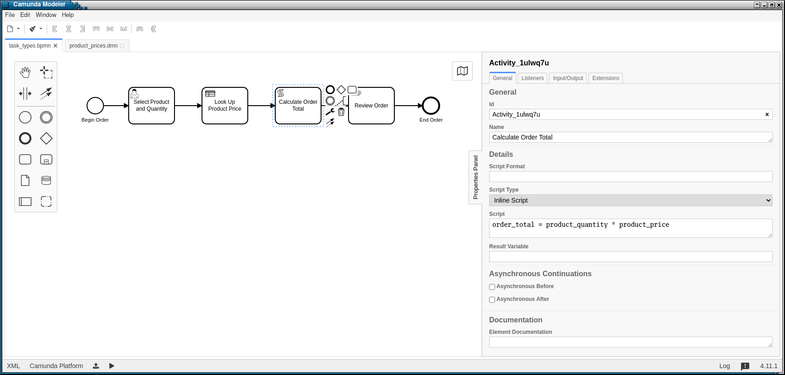
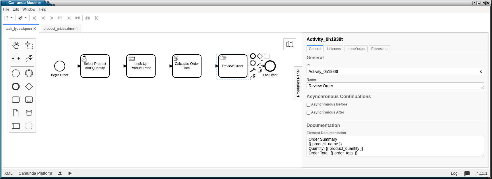

Tasks
=====

BPMN Model
----------

In this example, we'll model a customer selecting a product to illustrate
the basic task types that can be used with SpiffWorkflow.

We'll be using the the `task_types 
<https://github.com/sartography/SpiffExample/bpmn/task_types.bpmn>`_
workflow, as well as the `product_prices 
<https://github.com/sartography/SpiffExample/bpmn/product_prices.dmn>`_
DMN table from `SpiffExample <https://github.com/sartography/SpiffExample>`_.

User Tasks 
^^^^^^^^^^

User tasks would typically be used in the case where the task would be
completed from within the application.

User tasks can include forms that ask the user questions. When you click on a
user task in a BPMN modeler, the Properties Panel includes a form tab. Use this
tab to build your questions.

We'll ask our hypothetical user to choose a product and quantity.

The following example shows how a form might be set up in Camumda.

   User Task configuration

.. note::

  SpiffWorkflow has some basic support for the free Camunda modeler, to use its 
  form building capabilities, but we intend to encapsulate this support in an 
  extension module and remove it from the core library eventually.

See the `Handling User Tasks`_ section for a discussion of sample code.

Business Rule Tasks
^^^^^^^^^^^^^^^^^^^

In our business rule task, we'll use a DMN table to look up the price of the 
product the user chose.

We'll need to create a DMN table.  

What is DMN?
++++++++++++

Decision Model and Notation (DMN) is a standard for business decision 
modeling. DMN allows modelers to separate decision logic from process logic 
and maintain it in a table format. DMN is linked into BPMN with a *decision 
task*.

With DMN, business analysts can model the rules that lead to a decision 
in an easy to read table. Those tables can be executed directly by SpiffWorkflow.

This minimizes the risk of misunderstandings between business analysts and 
developers, and allows rapid changes in production.

BPMN includes a decision task that refers to the decision table. The outcome of 
the decision lookup allows the next gateway or activity to route the flow.

Our Business Rule Task will make use of a DMN table.

   DMN Table

.. note::
   We add quote marks around the product names in the table.  Spiff will
   create an expression based on the exact contents of the table, so if
   the quotes are omitted, the content will be interpreted as a variable.

Then we'll refer to this table in the task configuration.

   Business Rule Task configuration

Script Tasks
^^^^^^^^^^^^

The total order cost will need to be calculated on the fly.  We can do this in
a script task.  We'll configure the task with some simple python code.

   Script Task configuration

The code in the script will have access to the task data, so variables that
have been defined previously will be available to it.

Manual Tasks
^^^^^^^^^^^^

Our final task type is a manual task.  We would use this task in the situation
where the application might simply need to mark a task that requires user
involvement complete without gathering any additional information from them.

There is no special configuration for manual tasks.  However, this is a good
place to note that we can use the BPMN element Documentation field to display
more information about the context of the item.

Spiff is set up in a way that you could use any templating library you want, but 
we have used `Jinja <https://jinja.palletsprojects.com/en/3.0.x/>`_.

In this example, we'll present an order summary to our customer.

   Element Documentation

See the `Handling Manual Tasks`_ section for a discussion of sample code.

Running The Model
-----------------

If you have set up our example repository, this model can be run with the
following command:

.. code-block:: console

   ./run.py -p order_product -d bpmn/product_prices.dmn -b bpmn/task_types.bpmn

Example Application Code
------------------------

Handling User Tasks
^^^^^^^^^^^^^^^^^^^

We will need to provide a way to display the form data and collect the user's
responses.

.. code:: python

    for field in task.task_spec.form.fields:
        if isinstance(field, EnumFormField):
            option_map = dict([ (opt.name, opt.id) for opt in field.options ])
            options = "(" + ', '.join(option_map) + ")"
            prompt = f"{field.label} {options} "
            option = select_option(prompt, option_map.keys())
            response = option_map[option]
        else:
            response = input(f"{field.label} ")
            if field.type == "long":
                response = int(response)
        task.update_data_var(field.id, response)

The list of form fields for a task is stored in :code:`task.task_spec.form_fields`.

For Enumerated fields, we want to get the possible options and present them to
the user.  The variable names the fields were stored in :code:`field.id`, but since
we set labels for each of the fields, we'd like to display those instead, and map
the user's selection back to the variable name.

Our :code:`select_option` function simply repeats the prompt until the user
enters a value contained in the option list.

For other fields, we'll just store whatever the user enters, although in the case
where they data type was specified to be a :code:`long`, we'll convert it to a
number.

Finally, we need to explicitly store the user-provided response in a variable
with the expected name.

Handling Business Rule Tasks
^^^^^^^^^^^^^^^^^^^^^^^^^^^^

We do not need to do any special configuration to handle these business rule
tasks.  SpiffWorkflow does it all for us.

Handling Script Tasks
^^^^^^^^^^^^^^^^^^^^^

We do not need to do any special configuration to handle script tasks.  It is
possible to implement a custom script engine.  We demonstrate that process in 
Custom Script Engines section Advancd features.  However, the default script 
engine will work in many cases.

Handling Manual Tasks
^^^^^^^^^^^^^^^^^^^^^

Our code for manual tasks simply asks the user to confirm that the task has been
completed.

.. code:: python

    def complete_manual_task(task):
        display_task(task)
        input("Press any key to mark task complete")

This is the code for converting the Documentation property of the task into
something that can be present to the user.

The template string can be obtained from :code:`task.task_spec.documentation`.

As noted above, our template class comes from Jinja.  We render the template
using the task data, which is just a dictionary.

.. code:: python

    def display_task(task):
        print(f'\n{task.task_spec.description}')
        if task.task_spec.documentation is not None:
            template = Template(task.task_spec.documentation)
            print(template.render(task.data))

