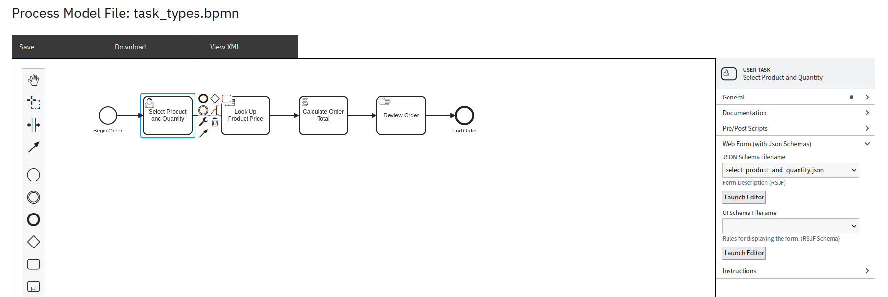
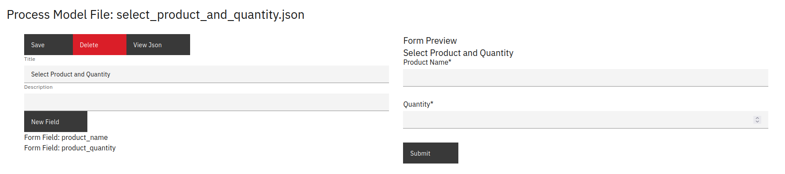
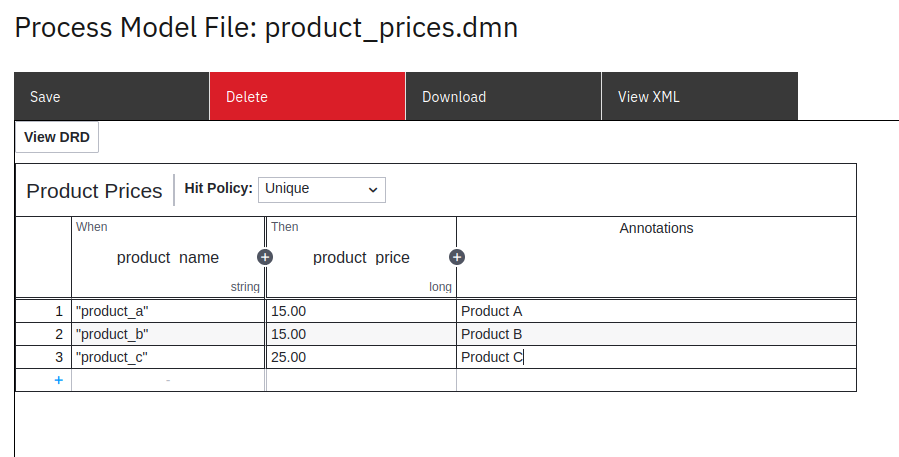
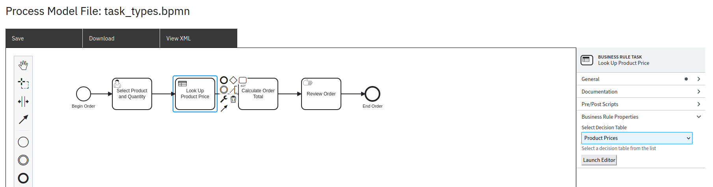
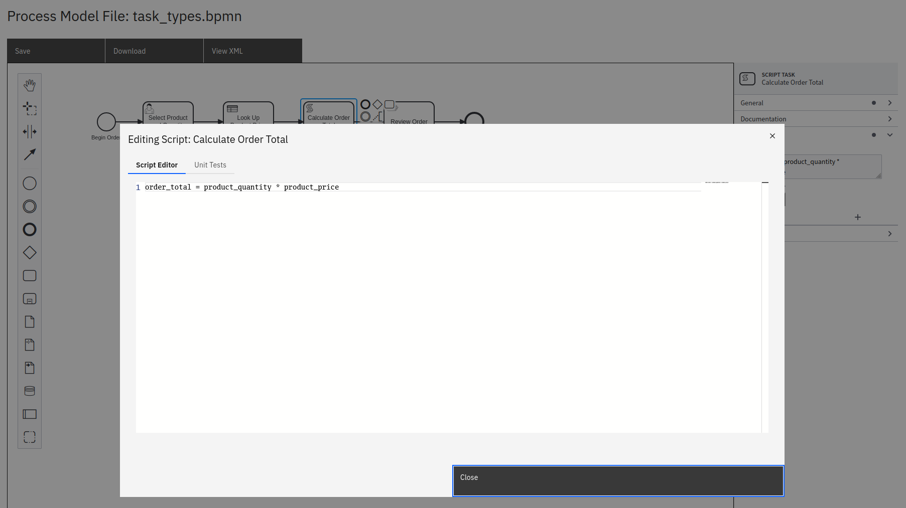
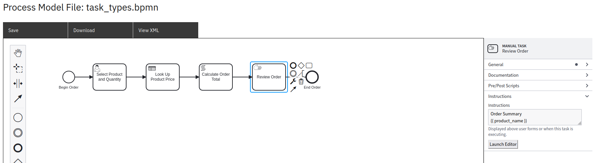
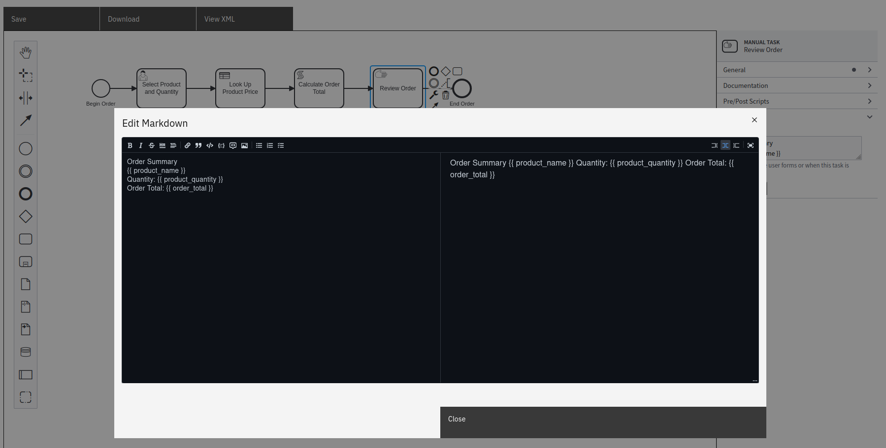

Tasks
=====

BPMN Model
----------

In this example, we'll model a customer selecting a product to illustrate the basic task types that
can be used with SpiffWorkflow.

We'll be using the following files from `spiff-example-cli <https://github.com/sartography/spiff-example-cli>`_:

- `task_types <https://github.com/sartography/spiff-example-cli/blob/main/bpmn/tutorial/task_types.bpmn>`_ workflow
- `product_prices <https://github.com/sartography/spiff-example-cli/blob/main/bpmn/tutorial/product_prices.dmn>`_ DMN table

User Tasks
^^^^^^^^^^

User Tasks would typically be used in the case where the task would be completed from within the
application. Our User tasks present forms that collect data from users.

We'll ask our hypothetical user to choose a product and quantity.

    User Task

We can use the form builder to create the form.

    User Task form

See the `Handling User Tasks`_ section for a discussion of sample code.

We have also retained some limited support for the now deprecated
camunda forms, which you can read about in our Camunda Specific section on :doc:`camunda/tasks`.

Business Rule Tasks
^^^^^^^^^^^^^^^^^^^

In our Business Rule Task, we'll use a DMN table to look up the price of the
product the user chose.

We'll need to create a DMN table.

What is DMN?
++++++++++++

Decision Model and Notation (DMN) is a standard for business decision
modeling. DMN allows modelers to separate decision logic from process logic
and maintain it in a table format. DMN is linked into BPMN with a *decision
task*.

With DMN, business analysts can model the rules that lead to a decision
in an easy to read table. Those tables can be executed directly by SpiffWorkflow.

This minimizes the risk of misunderstandings between business analysts and
developers, and allows rapid changes in production.

BPMN includes a decision task that refers to the decision table. The outcome of
the decision lookup allows the next gateway or activity to route the flow.

Our Business Rule Task will make use of a DMN table.

   DMN Table

.. note::
   We add quote marks around the product names in the table.  Spiff will
   create an expression based on the exact contents of the table, so if
   the quotes are omitted, the content will be interpreted as a variable
   rather than a string.

Then we'll refer to this table in the task configuration.

   Business Rule Task configuration

Script Tasks
^^^^^^^^^^^^

The total order cost will need to be calculated on the fly.  We can do this in
a Script Task.  We'll configure the task with some simple Python code.

   Script Task configuration

The code in the script will have access to the task data, so variables that
have been defined previously will be available to it.

Manual Tasks
^^^^^^^^^^^^

Our final task type is a Manual Task.  Manual Tasks represent work that occures
outside of SpiffWorkflow's control.  Say that you need to include a step in a
process where the participant needs to stand up, walk over to the coffee maker,
and poor the cup of coffee.  Manual Tasks pause the process, and wait for
confirmation that the step was completed.

Text that will be displayed to the user is added in the "Instructions" panel.

   Manual Task

Spiff's manual tasks may contain references to data inside the workflow.  We have used
`Jinja <https://jinja.palletsprojects.com/en/3.0.x/>`_, but Spiff is set up in a way that
you could use any templating library you want, as well as Markdown formatting directives
(we won't implement those here though, because it doesn't make sense for a command
line app).

   Editing Instructions

See the `Handling Manual Tasks`_ section for a discussion of sample code.

For information about how Spiff handles Manual Tasks created with Camunda please
refer to the Camunda Specific section on :doc:`camunda/tasks`.

Running The Model
^^^^^^^^^^^^^^^^^

If you have set up our example repository, this model can be run with the following command:

.. code-block:: console

   ./spiff-bpmn-runner.py -p order_product -d bpmn/tutorial/product_prices.dmn -b bpmn/tutorial/task_types.bpmn

Example Application Code
------------------------

Handling User Tasks
^^^^^^^^^^^^^^^^^^^

We will need to provide a way to display the form data and collect the user's
responses.

.. code:: python

        filename = task.task_spec.extensions['properties']['formJsonSchemaFilename']
        schema = json.load(open(os.path.join(forms_dir, filename)))
        for field, config in schema['properties'].items():
            if 'oneOf' in config:
                option_map = dict([ (v['title'], v['const']) for v in config['oneOf'] ])
                options = "(" + ', '.join(option_map) + ")"
                prompt = f"{field} {options} "
                option = input(prompt)
                while option not in option_map:
                    print(f'Invalid selection!')
                    option = input(prompt)
                response = option_map[option]
            else:
                response = input(f"{config['title']} ")
                if config['type'] == 'integer':
                    response = int(response)
            task.data[field] = response

SpiffWorkflow uses JSON Schema to represent forms, specifically
`react-jsonschema-form <https://react-jsonschema-form.readthedocs.io/en/latest/>`_.
Our forms are really intended to be displayed in a browser, and attempting to handle them in a command
line appliction is a little awkward.  The form specifications can be quite complex.

This simple implementation will present a list of options for simple enumerated fields and simply
directly stores whatever the user enters otherwise, with integer conversions if the field is so
specified.  This is robust enough to collect enough information from a user to make it through our example.

SpiffWorkflow provides a mechanism for you to provide your own form specification and leaves it up to you
to decide how to present it.

Handling Business Rule Tasks
^^^^^^^^^^^^^^^^^^^^^^^^^^^^

We do not need to do any special configuration to handle these Business Rule Tasks.  SpiffWorkflow does it all for us.

Handling Script Tasks
^^^^^^^^^^^^^^^^^^^^^

We do not need to do any special configuration to handle Script Tasks, although it
is possible to implement a custom script engine.  We demonstrate that process in
Custom Script Engines section :doc:`advanced` features.  However, the default script
engine will be adequate for now.

Handling Manual Tasks
^^^^^^^^^^^^^^^^^^^^^

Our code for manual tasks simply asks the user to confirm that the task has been
completed.

.. code:: python

    def complete_manual_task(task):
        display_instructions(task)
        input("Press any key to mark task complete")

:code:`display_instructions` handles presenting the task to the user.

.. code:: python

    def display_instructions(task):
        text = task.task_spec.extensions.get('instructionsForEndUser')
        print(f'\n{task.task_spec.bpmn_name}')
        if text is not None:
            template = Template(text)
            print(template.render(task.data))

The template string can be obtained from :code:`task.task_spec.extensions.get('instructionsForEndUser')`.

As noted above, our template class comes from Jinja.  We render the template
using the task data, which is just a dictionary.

.. note::

    Most of Spiff's task specifications contain this extension, not just Manual Tasks.  We also use it to display
    information along with forms, and about certain events.
